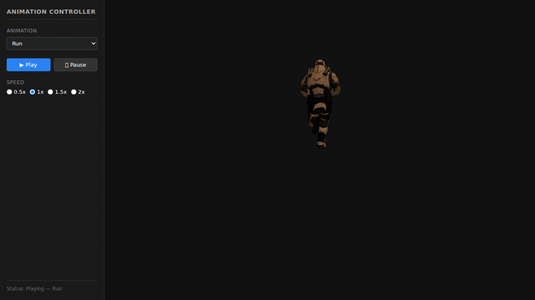
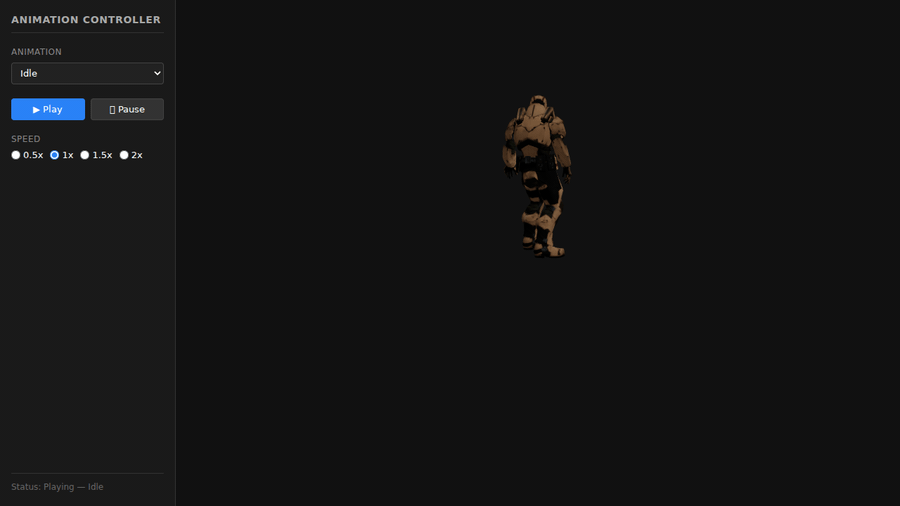

# Taller - Animaciones por Esqueleto: Importando y Reproduciendo Animaciones

## Nombre del estudiante
Gabriel Andrés Anzola Tachak

## Fecha de entrega
2026-04-14

---

## Descripción breve

Implementación de animaciones esqueléticas (skeletal animation) usando modelos **GLTF** descargados desde **Mixamo**. Se desarrolló una aplicación interactiva en **Three.js con React Three Fiber** que carga un modelo 3D con armadura, accede a múltiples clips de animación embebidos en el archivo, controla la reproducción con transiciones suaves (crossfade) y permite modificar la velocidad en tiempo real. El resultado es una interfaz responsiva con panel lateral que demuestra el flujo completo: carga → selección → transición → velocidad.

---

## Implementaciones

### Three.js / React Three Fiber (`threejs/`)

| Componente / Hook | Funcionalidad |
|-------------------|---------------|
| `AnimatedModel.jsx` | Carga GLTF con `useGLTF()`, obtiene acciones con `useAnimations()`, aplica fade |
| `AnimationController.jsx` | Dropdown de clips, botones play/pause, selector de velocidad (0.5×–2×) |
| `useSkeletalAnimation.js` | Hook personalizado: estado centralizado de animación activa, velocidad y play |
| `App.jsx` | Layout Canvas + panel lateral; pasa estado y callbacks hacia abajo |

**Stack:** React 18.2 · Three.js 0.160 · @react-three/fiber 8.15 · @react-three/drei 9.90 · Vite 5.1

---

## Resultados Visuales

### Three.js - Implementación


Animación Idle: el personaje en posición neutral con OrbitControls activos. El modelo renderiza correctamente el esqueleto (Soldier, Three.js examples).



Animación Run: diferencia de pose respecto a Idle. La transición entre clips usa crossfade de 0.5 s para evitar cambios abruptos.


Animación Walk con transición suave desde Idle (crossfade 0.5 s). El modelo incluye 4 clips: Idle, Run, TPose y Walk.



Vista general de la interfaz: panel lateral con dropdown, botones de control y selector de velocidad durante el ciclo Idle → Run → Walk.

---

## Código Relevante

### AnimatedModel.jsx — transiciones con fade

```jsx
import { useGLTF, useAnimations } from '@react-three/drei';

const AnimatedModel = ({ activeAnimation, isPlaying, speed }) => {
  const group = useRef();
  const { scene, animations } = useGLTF('/models/character.gltf');
  const { actions, mixer } = useAnimations(animations, group);

  useEffect(() => {
    if (!actions || !activeAnimation) return;
    Object.keys(actions).forEach(key => {
      if (key !== activeAnimation) actions[key].fadeOut(0.5);
    });
    const current = actions[activeAnimation];
    if (isPlaying) current.reset().fadeIn(0.5).play();
    else current.paused = true;
  }, [activeAnimation, isPlaying, actions]);

  useEffect(() => {
    if (mixer) mixer.timeScale = speed;
  }, [speed, mixer]);

  return <group ref={group}><primitive object={scene} /></group>;
};
```

### useSkeletalAnimation.js — hook de estado

```js
export const useSkeletalAnimation = (animations, actions, mixer) => {
  const [activeAnimation, setActiveAnimation] = useState(null);
  const [isPlaying, setIsPlaying] = useState(true);
  const [speed, setSpeed] = useState(1);

  const playAnimation = useCallback((name, fadeDuration = 0.5) => {
    Object.keys(actions).forEach(key => {
      if (key !== name) actions[key].fadeOut(fadeDuration);
    });
    actions[name].reset().fadeIn(fadeDuration).play();
    setActiveAnimation(name);
    setIsPlaying(true);
  }, [actions]);

  const togglePlay = useCallback(() => {
    const current = actions[activeAnimation];
    current.paused = !current.paused;
    setIsPlaying(!current.paused);
  }, [actions, activeAnimation]);

  const changeSpeed = useCallback((newSpeed) => {
    if (mixer) { mixer.timeScale = newSpeed; setSpeed(newSpeed); }
  }, [mixer]);

  return { activeAnimation, isPlaying, speed, playAnimation, togglePlay,
           changeSpeed, animationList: animations?.map(a => a.name) || [] };
};
```

### AnimationController.jsx — UI de control

```jsx
const AnimationController = ({ animationList, activeAnimation, isPlaying,
                               speed, onAnimationChange, onPlayPause, onSpeedChange }) => (
  <aside className="control-panel">
    <h2>Control de Animaciones</h2>
    <div className="section">
      <label>Animación:</label>
      <select value={activeAnimation || ''} onChange={e => onAnimationChange(e.target.value)}>
        <option value="">Seleccionar...</option>
        {animationList.map(name => <option key={name} value={name}>{name}</option>)}
      </select>
    </div>
    <div className="section">
      <button onClick={onPlayPause}>{isPlaying ? 'Pausar' : 'Reproducir'}</button>
    </div>
    <div className="section">
      <label>Velocidad:</label>
      {[0.5, 1, 1.5, 2].map(val => (
        <label key={val}>
          <input type="radio" value={val} checked={speed === val}
                 onChange={e => onSpeedChange(parseFloat(e.target.value))} />
          {val}x
        </label>
      ))}
    </div>
  </aside>
);
```

---

## Prompts Utilizados (IA Generativa)

```
"Crea la estructura base de un proyecto React con Vite para Three.js, 
incluyendo componentes para cargar un modelo GLTF con useGLTF() y 
controlar sus animaciones con useAnimations()"

"Implementa un hook personalizado useSkeletalAnimation que maneje 
transiciones suaves entre animaciones usando fadeIn() y fadeOut(), 
con soporte para play/pause y control de velocidad"

"Diseña una interfaz de control (AnimationController) que muestre 
un dropdown con todas las animaciones disponibles, botones de play/pause 
y selector de velocidad en multiplicadores (0.5x, 1x, 1.5x, 2x)"

"Optimiza el código para reducir renders innecesarios y asegurar que 
el mixer.timeScale se actualice correctamente cuando cambia la velocidad"
```

---

## Aprendizajes y Dificultades

- **AnimationMixer vs. acciones:** `AnimationMixer` es el motor de bajo nivel; `useAnimations()` de Drei lo abstrae exponiendo directamente las `actions` por nombre, lo que simplifica el control sin perder granularidad.
- **fadeOut + fadeIn:** Usar duraciones de 0.5 s en ambas direcciones evita pop visual. Llamar `.reset()` antes de `.fadeIn()` es obligatorio para reiniciar el clip desde el frame 0.
- **paused vs. timeScale = 0:** `action.paused` pausa una acción individual sin afectar al mixer; `mixer.timeScale = 0` detiene todo. La distinción importa cuando hay más de un clip activo durante el crossfade.
- **Sincronización de estado:** Al iniciar, `activeAnimation` puede ser `null` mientras `actions` ya está populado; el guard `if (!actions || !activeAnimation) return` evita errores de clave indefinida.
- **Armaduras anidadas en GLTF:** Si el modelo exportado desde Blender tiene armaduras anidadas, `useGLTF()` puede omitir clips. Solución: asegurar que todas las animaciones están asociadas a la armadura raíz antes de exportar.
- **Performance:** En modelos con muchos bones + OrbitControls + render por frame, usar `precision="mediump"` en el Canvas alivia la GPU en dispositivos de gama baja.

### Mejoras futuras

Blending por velocidad de personaje (blend Idle/Walk según magnitud de movimiento), control por teclado (Space, W, R), animation events para sincronizar audio, y soporte para varios personajes intercambiables.

---

## Estructura del Proyecto

```
semana_6_2_animaciones_esqueleto_fbx_gltf/
├── threejs/
│   ├── src/
│   │   ├── main.jsx
│   │   ├── App.jsx
│   │   ├── components/
│   │   │   ├── AnimatedModel.jsx
│   │   │   └── AnimationController.jsx
│   │   ├── hooks/
│   │   │   └── useSkeletalAnimation.js
│   │   └── styles.css
│   ├── public/models/character.glb
│   ├── index.html
│   ├── package.json
│   └── vite.config.js
├── media/
│   ├── idle_animation.gif
│   ├── run_animation.gif
│   ├── animation_transition.gif
│   └── full_ui.gif
└── README.md
```

---

## Referencias

- Three.js Animation System: https://threejs.org/docs/#api/en/animation/AnimationMixer
- Drei — useGLTF / useAnimations: https://github.com/pmndrs/drei
- React Three Fiber docs: https://docs.pmnd.rs/react-three-fiber/
- Three.js Soldier Model: https://threejs.org/examples/webgl_animation_skinning_blendweights.html
- Blender GLTF Export: https://docs.blender.org/manual/en/latest/addons/io_scene_gltf2/index.html

---

## Checklist

- [x] Carpeta `semana_6_2_animaciones_esqueleto_fbx_gltf`
- [x] Código limpio y funcional en `threejs/`
- [x] GIFs con nombres descriptivos en `media/`
- [x] README completo con todas las secciones requeridas
- [x] Mínimo 3 capturas/GIFs de diferentes animaciones (hay 4)
- [x] Transiciones suaves entre clips con crossfade
- [x] Control de velocidad (0.5×, 1×, 1.5×, 2×)
- [x] Commits descriptivos en inglés
- [x] Repositorio organizado y público
