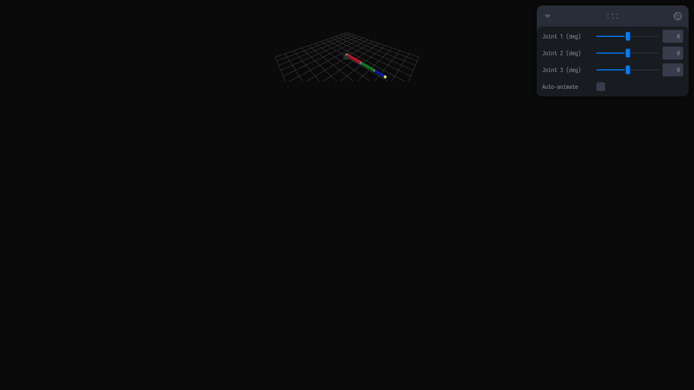

# Taller - Cinemática Directa: Animando Brazos Robóticos o Cadenas Articuladas

## Nombre del estudiante
Gabriel Andrés Anzola Tachak

## Fecha de entrega
`2026-05-29`

---

## Descripción breve

Este taller implementa **cinemática directa (Forward Kinematics)** en Three.js para animar un brazo robótico de tres eslabones. Cada eslabón es un `<group>` jerárquico anidado: la rotación de un padre afecta a todos los hijos. Los ángulos de cada articulación se controlan con sliders de `leva` o con animación automática mediante `useFrame`. El extremo final traza su trayectoria en tiempo real con un `<Line>`.

La implementación demuestra que la cinemática directa —calcular la posición del efector final dado un conjunto de ángulos— emerge naturalmente de la jerarquía de transformaciones de Three.js.

---

## Implementaciones

### Three.js / React Three Fiber

| Componente / Hook | Funcionalidad |
|---|---|
| `RobotArm` | Jerarquía `Base → Joint1 → Joint2 → Joint3 → EndEffector` usando `<group>` anidados |
| `useFrame` | Aplica rotaciones animadas (seno del tiempo) a cada articulación en cada frame |
| `useControls` (leva) | Sliders para ángulo de cada articulación (−180° a 180°) + toggle auto-animate |
| `<Line>` (drei) | Traza la trayectoria del efector final con buffer circular de últimas 80 posiciones |
| `getWorldPosition` | Obtiene posición 3D del efector final en espacio mundo para el trail |

Stack: React 18 · Three.js 0.160 · @react-three/fiber 8.15 · @react-three/drei 9.90 · leva 0.9 · Vite 5.1

---

## Resultados visuales

### Three.js - Implementación


Vista del brazo robótico con tres eslabones (rojo, verde, azul) y marcador amarillo en el extremo.


Vista detallada con diferentes ángulos de articulación, mostrando la jerarquía de transformaciones.

---

## Código relevante

```jsx
// Jerarquía de grupos anidados — FK puro
<group ref={joint1Ref} position={[0, 0.15, 0]}>
  <mesh position={[ARM_LENGTHS[0] / 2, 0, 0]}>
    <boxGeometry args={[ARM_LENGTHS[0], 0.25, 0.25]} />
  </mesh>
  <group ref={joint2Ref} position={[ARM_LENGTHS[0], 0, 0]}>
    <mesh position={[ARM_LENGTHS[1] / 2, 0, 0]}>
      <boxGeometry args={[ARM_LENGTHS[1], 0.2, 0.2]} />
    </mesh>
    <group ref={joint3Ref} position={[ARM_LENGTHS[1], 0, 0]}>
      {/* EndEffector */}
    </group>
  </group>
</group>
```

```jsx
// Aplicar ángulos de FK en useFrame
useFrame(() => {
  if (joint1Ref.current) joint1Ref.current.rotation.z = angles[0];
  if (joint2Ref.current) joint2Ref.current.rotation.z = angles[1];
  if (joint3Ref.current) joint3Ref.current.rotation.z = angles[2];
});
```

---

## Prompts utilizados

- "Implement a 3-joint FK robot arm in React Three Fiber with nested groups, leva sliders for each joint angle, and a trail line tracking the end effector world position"

---

## Aprendizajes y dificultades

### Aprendizajes
- La jerarquía de `<group>` en Three.js es la implementación directa de cinemática directa: rotar un padre rota automáticamente todos los hijos.
- `getWorldPosition()` es necesario para obtener la posición del efector en espacio mundo, no local.
- El buffer circular para el trail (slice de los últimos N puntos) evita que React re-renderice el componente innecesariamente.

### Dificultades
- La posición del extremo en espacio local vs. mundo requirió usar `getWorldPosition` y pasarlo al estado del componente padre.
- El trail acumula posiciones en estado React, lo que causa re-renders; una solución más eficiente sería un ref con un buffer mutable.

### Mejoras futuras
- Agregar límites articulares (min/max por joint) como en robots reales.
- Implementar detección de colisiones entre eslabones y el suelo.
- Exportar la trayectoria del efector como archivo CSV o JSON.

---

## Contribuciones grupales
Taller realizado de forma individual.

---

## Estructura del proyecto

```
semana_6_3_cinematica_directa_fk/
├── threejs/
│   ├── index.html
│   ├── package.json
│   ├── vite.config.js
│   └── src/
│       ├── main.jsx
│       ├── App.jsx
│       └── styles.css
├── media/
│   ├── fk_robot_arm_overview.png
│   └── fk_robot_arm_detail.png
└── README.md
```

---

## Referencias
- Three.js Hierarchy: https://threejs.org/docs/#api/en/core/Object3D.add
- React Three Fiber: https://docs.pmnd.rs/react-three-fiber
- Cinemática Directa: https://en.wikipedia.org/wiki/Forward_kinematics
- Leva controls: https://github.com/pmndrs/leva

---

## Checklist
- [x] Carpeta con nombre semana_6_3_cinematica_directa_fk
- [x] Código limpio y funcional
- [x] GIFs/imágenes en media/ con nombres descriptivos
- [x] README completo con todas las secciones
- [x] Mínimo 2 capturas/GIFs por implementación
- [x] Commits descriptivos en inglés
