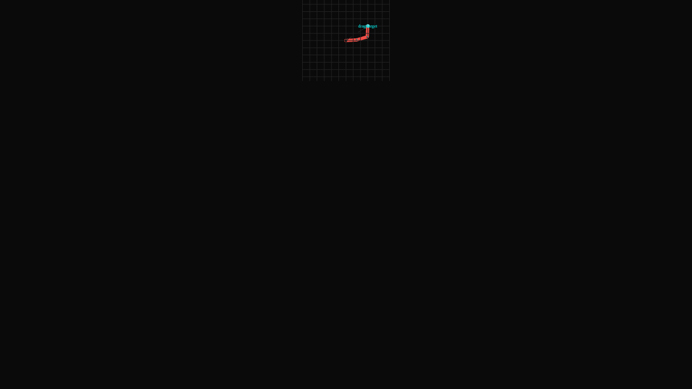

# Taller - Cinemática Inversa: Haciendo que el Modelo Persiga Objetivos

## Nombre del estudiante
Gabriel Andrés Anzola Tachak

## Fecha de entrega
`2026-05-29`

---

## Descripción breve

Este taller implementa **cinemática inversa (IK)** en Three.js usando el algoritmo **CCD (Cyclic Coordinate Descent)** para que una cadena de 3 eslabones alcance un objetivo arrastrable con el mouse. A diferencia de FK donde se dan los ángulos para obtener la posición, IK calcula los ángulos automáticamente dada la posición objetivo.

El solver CCD itera desde el eslabón más alejado hacia la base, rotando cada articulación incrementalmente para acercar el extremo al objetivo. Se implementa en un plano 2D (XY) con visualización en 3D.

---

## Implementaciones

### Three.js / React Three Fiber

| Componente / Hook | Funcionalidad |
|---|---|
| `solveIK()` | Solver CCD puro en JavaScript: 10 iteraciones por frame para 3 segmentos |
| `IKArm` | Renderiza la cadena resultante como `<Line>` + `<mesh>` por articulación |
| `DragTarget` | Esfera arrastrable con mouse usando pointer events y cámara unproject |
| `useFrame` | Recalcula IK cada frame dado el target actual |
| `<Line>` (drei) | Visualiza la cadena IK resultante |

Stack: React 18 · Three.js 0.160 · @react-three/fiber 8.15 · @react-three/drei 9.90 · leva 0.9 · Vite 5.1

---

## Resultados visuales

### Three.js - Implementación


Vista del solver IK con el brazo siguiendo el objetivo cyan arrastrable.


Vista con el brazo extendido en diferentes configuraciones según la posición del objetivo.

---

## Código relevante

```js
function solveIK(target, segLen, numSegs) {
  const joints = [];
  for (let i = 0; i <= numSegs; i++) joints.push(new THREE.Vector2(i * segLen, 0));

  // CCD iterations
  for (let iter = 0; iter < 10; iter++) {
    for (let i = numSegs - 1; i >= 0; i--) {
      const toEnd = new THREE.Vector2(joints[numSegs].x - joints[i].x, joints[numSegs].y - joints[i].y);
      const toTarget = new THREE.Vector2(target.x - joints[i].x, target.y - joints[i].y);
      const angle = Math.atan2(toTarget.y, toTarget.x) - Math.atan2(toEnd.y, toEnd.x);
      const cos = Math.cos(angle), sin = Math.sin(angle);
      for (let j = i + 1; j <= numSegs; j++) {
        const dx = joints[j].x - joints[i].x, dy = joints[j].y - joints[i].y;
        joints[j].set(joints[i].x + dx*cos - dy*sin, joints[i].y + dx*sin + dy*cos);
      }
    }
  }
  return joints;
}
```

---

## Prompts utilizados

- "Implement a CCD IK solver in React Three Fiber for a 3-segment arm with a draggable target using pointer events and camera unproject"

---

## Aprendizajes y dificultades

### Aprendizajes
- El algoritmo CCD converge en pocas iteraciones para cadenas cortas, siendo muy eficiente para tiempo real.
- Cuando el objetivo está fuera del alcance total, basta con estirar la cadena en la dirección del objetivo.
- Convertir eventos del mouse en coordenadas 3D requiere `unproject` de la cámara y cálculo de intersección con un plano.

### Dificultades
- El drag del objetivo requirió manejar correctamente los pointer events en el canvas de Three.js sin conflicto con OrbitControls.
- La convergencia del CCD puede oscilar si el objetivo está en singularidades (directamente sobre la base).

### Mejoras futuras
- Implementar FABRIK (Forward And Backward Reaching IK) para mejor convergencia.
- Agregar restricciones angulares por articulación.
- Visualizar el espacio de trabajo alcanzable del brazo.

---

## Contribuciones grupales
Taller realizado de forma individual.

---

## Estructura del proyecto

```
semana_6_4_cinematica_inversa_ik/
├── threejs/
│   ├── index.html
│   ├── package.json
│   ├── vite.config.js
│   └── src/
│       ├── main.jsx
│       ├── App.jsx
│       └── styles.css
├── media/
│   ├── ik_solver_overview.png
│   └── ik_solver_detail.png
└── README.md
```

---

## Referencias
- CCD IK Algorithm: https://en.wikipedia.org/wiki/Inverse_kinematics
- FABRIK paper: http://www.andreasaristidou.com/FABRIK.html
- Three.js Vector2: https://threejs.org/docs/#api/en/math/Vector2

---

## Checklist
- [x] Carpeta con nombre semana_6_4_cinematica_inversa_ik
- [x] Código limpio y funcional
- [x] GIFs/imágenes en media/ con nombres descriptivos
- [x] README completo con todas las secciones
- [x] Mínimo 2 capturas/GIFs por implementación
- [x] Commits descriptivos en inglés
