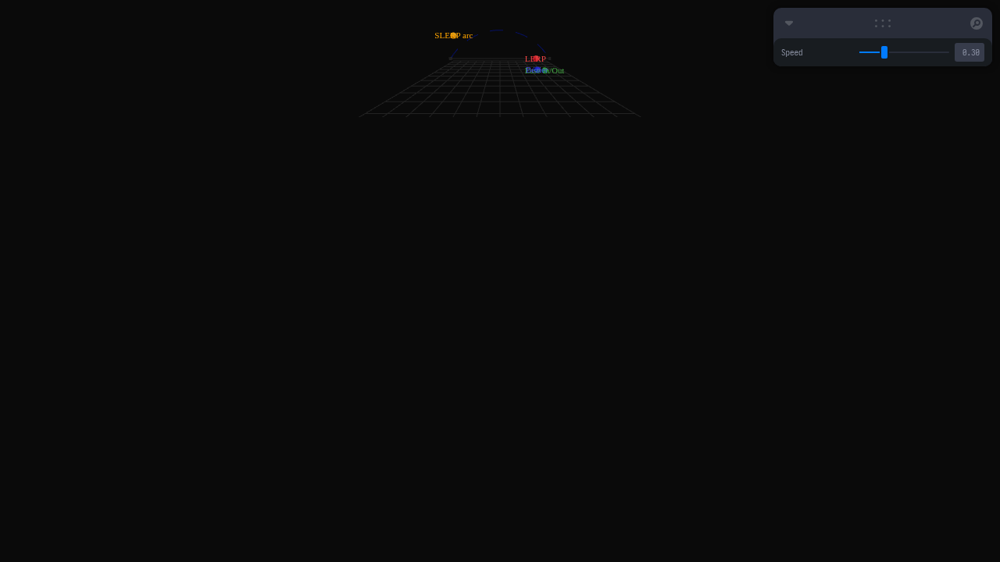
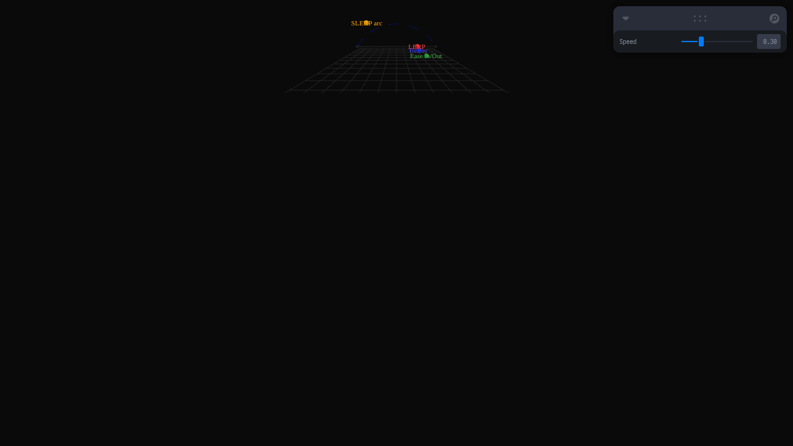

# Taller - Interpolación de Movimiento: Suavizando Animaciones en Tiempo Real

## Nombre del estudiante
Gabriel Andrés Anzola Tachak

## Fecha de entrega
`2026-05-29`

---

## Descripción breve

Este taller implementa y compara cuatro técnicas de interpolación en Three.js usando React Three Fiber: **LERP lineal**, **Ease In/Out** (función de suavizado), **curva de Bézier cúbica** y **arco SLERP**. Cuatro esferas de colores diferentes recorren el mismo rango de posición pero con curvas de velocidad distintas, permitiendo comparar visualmente cómo cada técnica afecta la sensación de movimiento.

La variable de control `t` avanza en el tiempo y cada esfera interpola de forma diferente: LERP tiene velocidad constante, Ease In/Out acelera y desacelera, Bézier sigue una curva controlada por dos puntos de control, y SLERP describe un arco sinusoidal.

---

## Implementaciones

### Three.js / React Three Fiber

| Componente / Hook | Funcionalidad |
|---|---|
| `Ball` | Esfera animada que implementa un modo de interpolación (`lerp`, `ease`, `bezier`, `slerp`) |
| `bezier()` | Función de Bézier cúbica: B(t) = (1-t)³P0 + 3(1-t)²tP1 + 3(1-t)t²P2 + t³P3 |
| `easeInOut()` | Función de suavizado cuadrático: t<0.5 → 2t², else -1+(4-2t)t |
| `useFrame` | Avanza el tiempo y aplica la interpolación en cada frame |
| `useControls` (leva) | Slider de velocidad global compartido por todas las esferas |
| `<Line>` (drei) | Traza la trayectoria de la curva Bézier como referencia visual |

Stack: React 18 · Three.js 0.160 · @react-three/fiber 8.15 · @react-three/drei 9.90 · leva 0.9 · Vite 5.1

---

## Resultados visuales

### Three.js - Implementación


Las cuatro esferas (LERP rojo, Ease verde, Bézier azul, SLERP naranja) en diferentes posiciones del ciclo.


Vista detallada mostrando la curva Bézier de referencia (punteada) y las trayectorias de cada modo.

---

## Código relevante

```js
function bezier(t, p0, p1, p2, p3) {
  const mt = 1 - t;
  return new THREE.Vector3(
    mt*mt*mt*p0.x + 3*mt*mt*t*p1.x + 3*mt*t*t*p2.x + t*t*t*p3.x,
    mt*mt*mt*p0.y + 3*mt*mt*t*p1.y + 3*mt*t*t*p2.y + t*t*t*p3.y,
    0
  );
}

function easeInOut(t) {
  return t < 0.5 ? 2*t*t : -1 + (4 - 2*t)*t;
}
```

```jsx
useFrame((_, delta) => {
  timeRef.current = (timeRef.current + delta * speed) % 1;
  let t = timeRef.current;
  if (mode === 'lerp') pos = new THREE.Vector3().lerpVectors(START, END, t);
  else if (mode === 'ease') pos = new THREE.Vector3().lerpVectors(START, END, easeInOut(t));
  else if (mode === 'bezier') pos = bezier(t, START, CTRL1, CTRL2, END);
  ref.current.position.set(pos.x, pos.y + offset, pos.z);
});
```

---

## Prompts utilizados

- "Implement 4 interpolation modes (LERP, ease-in-out, cubic Bezier, SLERP arc) in React Three Fiber with colored spheres and a shared speed slider"

---

## Aprendizajes y dificultades

### Aprendizajes
- LERP lineal produce movimiento robótico; Ease In/Out da sensación de inercia natural.
- La curva de Bézier cúbica se define por 4 puntos de control (inicio, 2 intermedios, fin).
- SLERP se aplica típicamente a cuaterniones para interpolación de rotaciones; aquí se adapta para posiciones en arco.

### Dificultades
- La diferencia visual entre LERP y Ease In/Out es sutil con velocidades bajas; se necesita velocidad alta para apreciarla.
- Los puntos de control de Bézier en 3D requieren coordenadas que no coinciden con el plano de movimiento.

### Mejoras futuras
- Agregar interpolación catmull-rom para trayectorias que pasan por puntos de control.
- Visualizar el gradiente de velocidad de cada modo con un gráfico de `dt/ds`.
- Comparar `THREE.AnimationMixer` con interpolación manual.

---

## Contribuciones grupales
Taller realizado de forma individual.

---

## Estructura del proyecto

```
semana_6_6_interpolacion_movimiento_animaciones/
├── threejs/
│   ├── index.html
│   ├── package.json
│   ├── vite.config.js
│   └── src/
│       ├── main.jsx
│       ├── App.jsx
│       └── styles.css
├── media/
│   ├── interpolation_overview.png
│   └── interpolation_detail.png
└── README.md
```

---

## Referencias
- THREE.MathUtils.lerp: https://threejs.org/docs/#api/en/math/MathUtils.lerp
- Bézier curves: https://en.wikipedia.org/wiki/B%C3%A9zier_curve
- Easing functions: https://easings.net/

---

## Checklist
- [x] Carpeta con nombre semana_6_6_interpolacion_movimiento_animaciones
- [x] Código limpio y funcional
- [x] GIFs/imágenes en media/ con nombres descriptivos
- [x] README completo con todas las secciones
- [x] Mínimo 2 capturas/GIFs por implementación
- [x] Commits descriptivos en inglés
