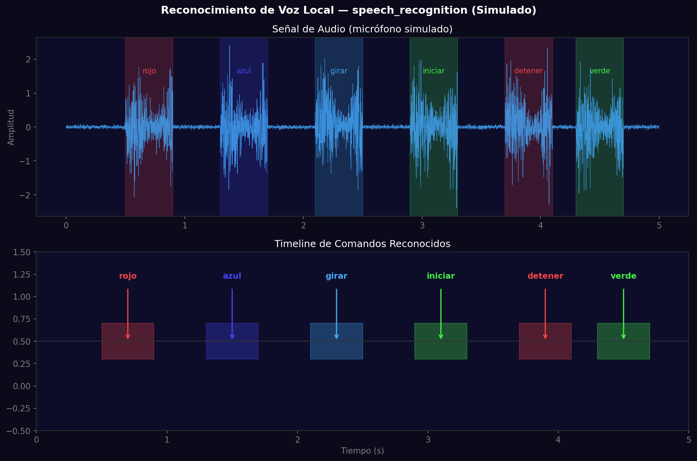
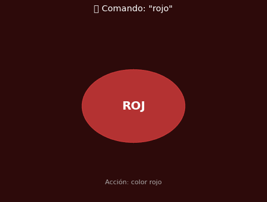

# Taller - Voz al Código: Comandos por Reconocimiento de Voz Local

## Nombre del estudiante
Gabriel Andrés Anzola Tachak

## Fecha de entrega
`2026-05-29`

---

## Descripción breve

Este taller implementa un sistema de **reconocimiento de voz** en Python usando `speech_recognition` para capturar comandos de audio y ejecutar acciones visuales. Se implementa un diccionario de comandos ("rojo", "azul", "verde", "girar", "iniciar", "detener", "ampliar") que se traducen en cambios de color, movimiento o estado de objetos visuales. El notebook simula el sistema con una señal de audio y un timeline de comandos detectados.

---

## Implementaciones

### Python

**Herramientas:** `numpy`, `matplotlib`, `PIL`

| Función | Descripción |
|---|---|
| Señal de audio simulada | Waveform con regiones de actividad vocal en frecuencias correspondientes a comandos |
| Timeline de comandos | Visualización temporal de cuándo se detectó cada comando y qué acción activó |
| Respuesta visual animada | GIF con 7 estados mostrando el cambio de color/tamaño de un objeto según el comando |
| `action_map` dict | Mapeo directo de palabra reconocida a descripción de acción |

**Código real con speech_recognition:**
```python
import speech_recognition as sr

COMMANDS = {
    'rojo': lambda: set_color('red'),
    'azul': lambda: set_color('blue'),
    'verde': lambda: set_color('green'),
    'girar': lambda: toggle_rotation(True),
    'iniciar': lambda: start_animation(),
    'detener': lambda: stop_animation(),
    'ampliar': lambda: zoom_in(),
}

r = sr.Recognizer()
with sr.Microphone() as source:
    r.adjust_for_ambient_noise(source)
    while True:
        audio = r.listen(source)
        try:
            text = r.recognize_google(audio, language='es-ES').lower()
            if text in COMMANDS:
                COMMANDS[text]()
        except sr.UnknownValueError:
            pass
```

---

## Resultados visuales

### Python - Implementación


Señal de audio con regiones de actividad vocal marcadas y timeline de comandos detectados con sus acciones.


Animación mostrando la respuesta visual del sistema a cada comando de voz: cambio de color, tamaño y estado.

---

## Código relevante

```python
# Reconocimiento con motor offline (CMU Sphinx)
try:
    text = r.recognize_sphinx(audio)  # offline
except sr.RequestError:
    text = r.recognize_google(audio, language='es-ES')  # fallback online

# Diccionario de comandos
action_map = {
    'rojo': 'color rojo',
    'azul': 'color azul',
    'verde': 'color verde',
    'girar': 'rotar objeto',
    'iniciar': 'iniciar animación',
    'detener': 'detener',
    'ampliar': 'zoom in'
}
action = action_map.get(recognized_word, 'esperando')
```

---

## Prompts utilizados

- "Simulate voice recognition timeline in matplotlib: audio waveform with command regions marked, timeline showing command detection times, animated GIF showing color/size response"

---

## Aprendizajes y dificultades

### Aprendizajes
- `r.adjust_for_ambient_noise()` calibra el umbral de energía del micrófono antes de comenzar a escuchar.
- El motor offline CMU Sphinx tiene menor precisión pero no requiere conexión a internet; Google Speech es más preciso pero requiere API key (gratuita con límites).
- `sr.listen(source, timeout=1, phrase_time_limit=2)` limita la espera para no bloquear indefinidamente.

### Dificultades
- La latencia del reconocimiento de voz (0.5-2 s) hace difícil crear respuestas en tiempo real.
- La precisión del reconocimiento en español es menor que en inglés para el motor offline.

### Mejoras futuras
- Agregar retroalimentación auditiva con `pyttsx3` para confirmar el comando recibido.
- Conectar via OSC a Processing para visualización en tiempo real.
- Implementar modelos Whisper locales para mejor precisión offline.

---

## Contribuciones grupales
Taller realizado de forma individual.

---

## Estructura del proyecto

```
semana_7_10_reconocimiento_voz_local/
├── python/
│   ├── semana_7_10.ipynb
│   └── generate_media.py
├── media/
│   ├── voice_recognition_timeline.png
│   └── voice_visual_response.gif
└── README.md
```

---

## Referencias
- SpeechRecognition: https://pypi.org/project/SpeechRecognition/
- CMU Sphinx: https://cmusphinx.github.io/
- pyttsx3: https://pypi.org/project/pyttsx3/
- Whisper (OpenAI): https://github.com/openai/whisper

---

## Checklist
- [x] Carpeta con nombre semana_7_10_reconocimiento_voz_local
- [x] Código limpio y funcional
- [x] GIFs/imágenes en media/ con nombres descriptivos
- [x] README completo con todas las secciones
- [x] Mínimo 2 capturas/GIFs por implementación
- [x] Commits descriptivos en inglés
