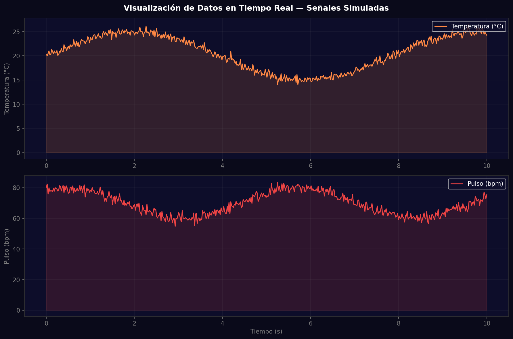
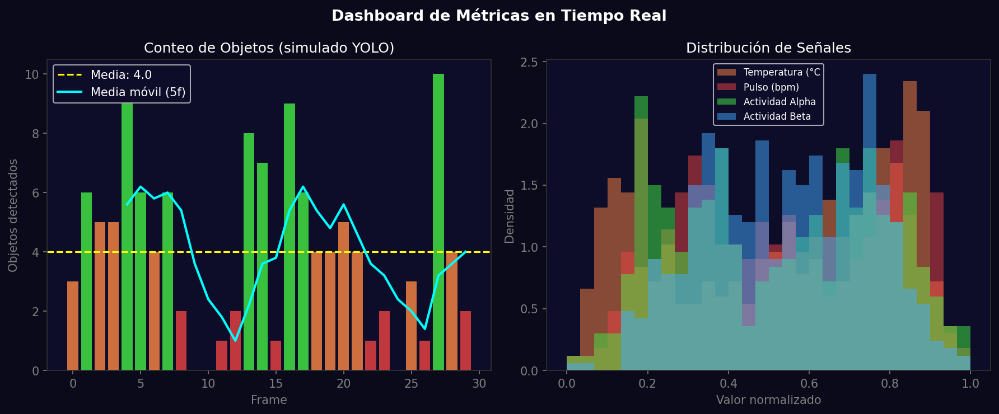
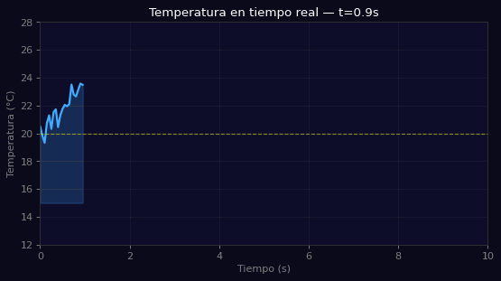

# Taller - Visualización de Datos en Tiempo Real: Gráficas en Movimiento

## Nombre del estudiante
Gabriel Andrés Anzola Tachak

## Fecha de entrega
`2026-05-29`

---

## Descripción breve

Este taller implementa visualización de datos en tiempo real en Python usando `matplotlib` y `numpy`. Se simulan cuatro señales (temperatura, pulso, actividad alpha/beta) con componentes sinusoidales y ruido gaussiano. Se implementa un dashboard con gráficos de línea en tiempo real, histogramas de distribución, conteo de objetos con media móvil, y un GIF animado que simula el avance temporal de una gráfica de temperatura.

---

## Implementaciones

### Python

**Herramientas:** `numpy`, `matplotlib`, `matplotlib.animation`, `PIL`

| Función | Descripción |
|---|---|
| Señales simuladas | 4 señales: temperatura (sin 0.8 Hz), pulso (sin 1.2 Hz), alpha (2.5 Hz), beta (4 Hz) |
| Gráfico de línea con fill | Área bajo la curva con `fill_between` para énfasis visual |
| Conteo de objetos | Array de conteos tipo YOLO con media móvil de ventana 5 frames |
| Histograma de distribución | Densidad normalizada de cada señal con colores diferenciados |
| GIF tiempo real | 20 frames con ventana deslizante simulando feed de datos en vivo |

---

## Resultados visuales

### Python - Implementación


Dashboard de dos señales en tiempo real (temperatura y pulso) con área bajo la curva.


Conteo de objetos detectados con media móvil y distribución de las señales.


Animación de 20 frames mostrando el avance temporal de la gráfica de temperatura.

---

## Código relevante

```python
import matplotlib.animation as animation
import numpy as np

# Datos en tiempo real con FuncAnimation
fig, ax = plt.subplots()
x_data, y_data = [], []

def update(frame):
    t = frame * 0.1
    x_data.append(t)
    y_data.append(20 + 5 * np.sin(t * 0.8) + np.random.randn() * 0.5)
    ax.clear()
    ax.plot(x_data, y_data, 'cyan')
    ax.fill_between(x_data, y_data, alpha=0.2)

ani = animation.FuncAnimation(fig, update, frames=200, interval=50)

# Media móvil
window = 5
rolling_avg = np.convolve(counts, np.ones(window)/window, mode='valid')
```

---

## Prompts utilizados

- "Generate real-time data visualization in matplotlib: 4 simulated signals with noise, rolling window bar chart for object counts, histogram distributions, animated sliding-window GIF"

---

## Aprendizajes y dificultades

### Aprendizajes
- `matplotlib.animation.FuncAnimation` actualiza la figura en cada frame; para headless se usa `plt.savefig()` frame por frame.
- `np.convolve(data, np.ones(n)/n, mode='valid')` es la forma más directa de calcular una media móvil.
- `fill_between` añade énfasis visual a las gráficas de línea sin overhead significativo.

### Dificultades
- `FuncAnimation` es difícil de renderizar headless; el approach de PIL frame-by-frame es más portable.
- La actualización en tiempo real con Jupyter requiere `%matplotlib widget` o salidas `clear_output(wait=True)`.

### Mejoras futuras
- Conectar a una fuente de datos real (sensor Arduino, OpenCV, YOLO) para datos en vivo.
- Usar Plotly con Dash para un dashboard interactivo en el navegador.
- Agregar alertas automáticas cuando una señal supera un umbral (semáforo visual).

---

## Contribuciones grupales
Taller realizado de forma individual.

---

## Estructura del proyecto

```
semana_7_11_visualizacion_datos_tiempo_real_graficas/
├── python/
│   ├── semana_7_11.ipynb
│   └── generate_media.py
├── media/
│   ├── realtime_line_chart.png
│   ├── realtime_dashboard_stats.png
│   └── realtime_animation.gif
└── README.md
```

---

## Referencias
- matplotlib FuncAnimation: https://matplotlib.org/stable/api/animation_api.html
- Plotly Dash: https://dash.plotly.com/
- Rolling average numpy: https://numpy.org/doc/stable/reference/generated/numpy.convolve.html

---

## Checklist
- [x] Carpeta con nombre semana_7_11_visualizacion_datos_tiempo_real_graficas
- [x] Código limpio y funcional
- [x] GIFs/imágenes en media/ con nombres descriptivos
- [x] README completo con todas las secciones
- [x] Mínimo 2 capturas/GIFs por implementación
- [x] Commits descriptivos en inglés
