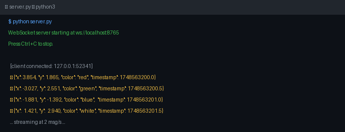
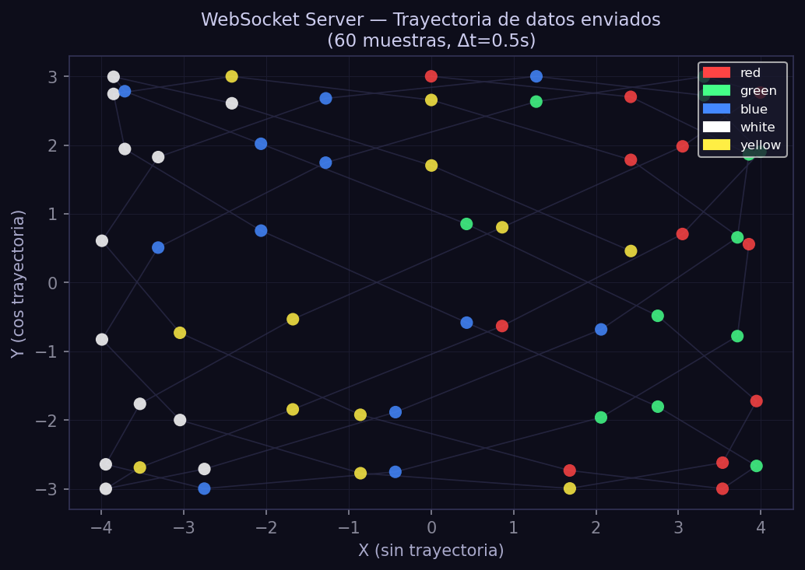
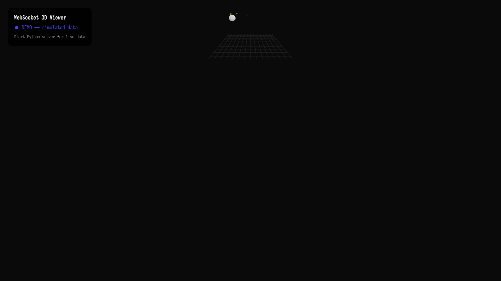
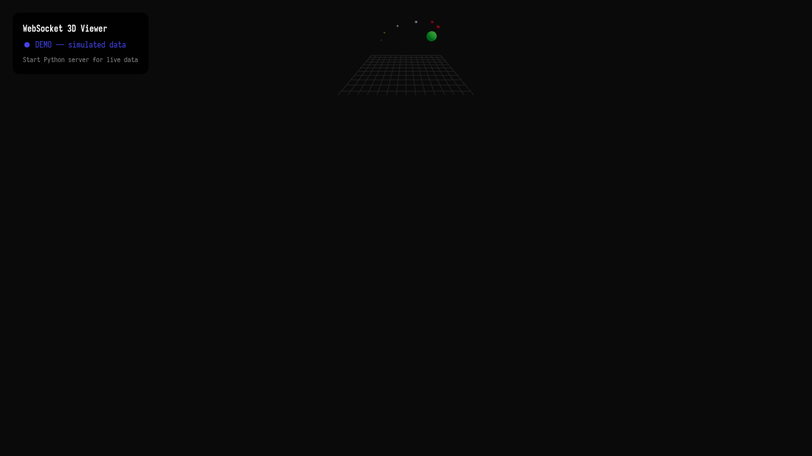

# Taller - WebSockets e Interacción Visual en Tiempo Real

## Nombre del estudiante
Gabriel Andrés Anzola Tachak

## Fecha de entrega
`2026-05-29`

---

## Descripción breve

Este taller implementa comunicación en **tiempo real** entre un servidor Python (WebSocket) y un cliente Three.js (WebSocket en navegador). El servidor envía cada 500 ms un JSON con coordenadas y color aleatorios. El cliente Three.js mueve una esfera a las nuevas coordenadas con interpolación LERP suave y mantiene un trail de las últimas 30 posiciones. Cuando el servidor no está disponible, el cliente entra en **modo demo** con datos simulados automáticamente.

---

## Implementaciones

### Python (Servidor WebSocket)

**Herramientas:** `asyncio`, `websockets`, `json`, `math`

| Función | Descripción |
|---|---|
| `handler()` | Coroutine que envía datos cada 500 ms a cada cliente conectado |
| Formato JSON | `{"x": float, "y": float, "color": string, "timestamp": float}` |
| `asyncio.run()` | Event loop async para servidor WebSocket en `localhost:8765` |

### Three.js / React Three Fiber (Cliente)

| Componente / Hook | Funcionalidad |
|---|---|
| `WebSocket` nativo | Conexión a `ws://localhost:8765`; fallback automático a modo demo |
| `DataSphere` | Esfera con interpolación LERP de posición para movimiento suave |
| `ConnectionStatus` | Panel de estado: connecting / connected / disconnected / demo |
| Trail de historial | Las últimas 30 posiciones renderizadas con opacidad y tamaño decreciente |
| Modo demo | Intervalo setInterval que genera datos simulados cuando el servidor no está disponible |

Stack: React 18 · Three.js 0.160 · @react-three/fiber 8.15 · @react-three/drei 9.90 · Vite 5.1

---

## Resultados visuales

### Python — Servidor WebSocket


Terminal del servidor WebSocket arrancado en `localhost:8765`, mostrando mensaje de inicio y muestra del JSON enviado a cada cliente.


Trayectoria XY de los datos enviados por el servidor (60 muestras, Δt=0.5 s). El color de cada punto corresponde al campo `color` del JSON — el movimiento sigue las funciones `sin(1.3t)` y `cos(0.9t)`.

### Three.js - Cliente WebSocket


Vista del cliente Three.js en modo demo con la esfera moviéndose y el trail de historial visible.


Vista con el trail de posiciones históricas mostrando el patrón sinusoidal de movimiento.

---

## Código relevante

**Servidor Python:**
```python
async def handler(websocket):
    t = 0
    while True:
        data = {
            "x": round(math.sin(t * 1.3) * 4, 3),
            "y": round(math.cos(t * 0.9) * 3, 3),
            "color": COLORS[int(t) % len(COLORS)],
            "timestamp": round(time.time(), 3),
        }
        await websocket.send(json.dumps(data))
        await asyncio.sleep(0.5)
        t += 0.5
```

**Cliente Three.js:**
```jsx
useEffect(() => {
  const ws = new WebSocket('ws://localhost:8765');
  ws.onopen = () => setStatus('connected');
  ws.onmessage = e => {
    const data = JSON.parse(e.data);
    setWsData(data);
    setHistory(h => [...h.slice(-30), data]);
  };
  ws.onerror = () => startDemoMode();
  return () => ws.close();
}, []);
```

---

## Prompts utilizados

- "Python asyncio WebSocket server sending JSON with x/y coordinates and color every 500ms, React Three Fiber client with sphere that moves with LERP interpolation and history trail"

---

## Aprendizajes y dificultades

### Aprendizajes
- WebSockets permiten comunicación bidireccional persistente con latencia mínima vs. polling HTTP.
- El cliente Three.js debe usar el WebSocket nativo del navegador (no Node.js `ws`).
- LERP de posición en `useFrame` crea transiciones suaves incluso con actualizaciones discretas cada 500 ms.

### Dificultades
- CORS no aplica a WebSockets, pero el servidor debe estar en el mismo origen o CORS configurado para HTTP.
- El modo fallback a datos demo es esencial para que el cliente funcione sin el servidor corriendo.

### Mejoras futuras
- Agregar comunicación bidireccional: el cliente envía eventos de clic al servidor.
- Implementar múltiples clientes simultáneos con identificadores únicos.
- Usar Socket.IO para mayor robustez y reconexión automática.

---

## Contribuciones grupales
Taller realizado de forma individual.

---

## Estructura del proyecto

```
semana_7_12_websockets_interaccion_visual/
├── threejs/
│   ├── index.html
│   ├── package.json
│   ├── vite.config.js
│   └── src/
│       ├── main.jsx
│       ├── App.jsx
│       └── styles.css
├── python/
│   ├── semana_7_12.ipynb
│   └── server.py
├── media/
│   ├── python_server_terminal.png
│   ├── python_data_stream.png
│   ├── websocket_viewer_overview.png
│   └── websocket_viewer_detail.png
└── README.md
```

---

## Referencias
- websockets Python: https://websockets.readthedocs.io/
- WebSocket API (browser): https://developer.mozilla.org/en-US/docs/Web/API/WebSocket
- Socket.IO: https://socket.io/

---

## Checklist
- [x] Carpeta con nombre semana_7_12_websockets_interaccion_visual
- [x] Código limpio y funcional
- [x] GIFs/imágenes en media/ con nombres descriptivos
- [x] README completo con todas las secciones
- [x] Mínimo 2 capturas/GIFs por implementación
- [x] Commits descriptivos en inglés
