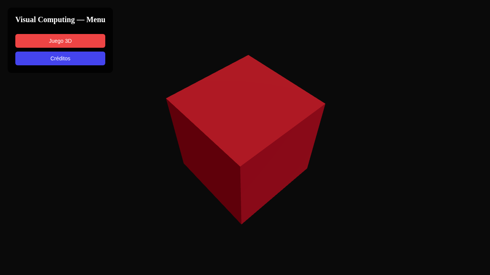
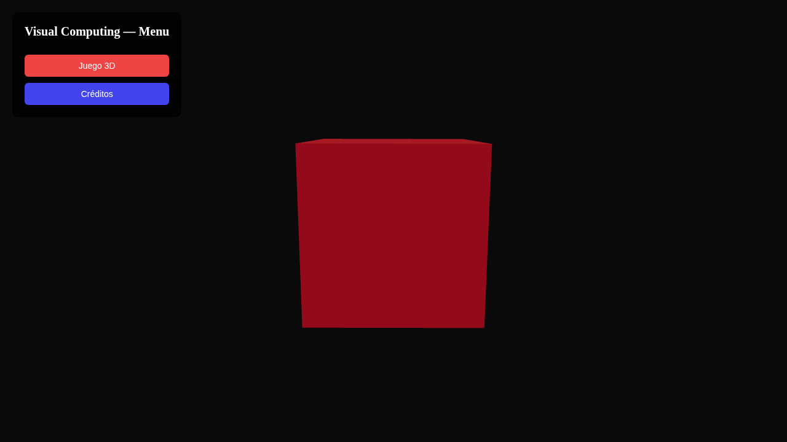

# Taller - Arquitectura de Escenas y Navegación en Three.js

## Nombre del estudiante
Gabriel Andrés Anzola Tachak

## Fecha de entrega
`2026-05-29`

---

## Descripción breve

Este taller implementa una arquitectura de navegación multi-escena en Three.js usando **React Router DOM**. La aplicación tiene tres rutas (`/`, `/juego`, `/creditos`) cada una con su propia escena 3D independiente. El menú principal muestra un cubo rotando, la escena de juego tiene partículas animadas en el espacio, y los créditos muestran un campo de estrellas.

La arquitectura modular separa cada escena en un componente React propio, con su propio Canvas de R3F. La navegación se realiza mediante botones HTML superpuestos sobre el canvas 3D.

---

## Implementaciones

### Three.js / React Three Fiber

| Componente / Hook | Funcionalidad |
|---|---|
| `BrowserRouter + Routes` | Enrutamiento declarativo entre escenas usando react-router-dom |
| `MenuScene` | Escena principal con cubo rotando y botones de navegación |
| `GameScene` | Escena de juego con 30 partículas animadas por funciones sinusoidales |
| `CreditsScene` | Campo de estrellas 3D procedural |
| `AnimSphere` | Esfera individual con trayectoria orbital paramétrica usando `useFrame` |
| `StarField` | 100 puntos estelares distribuidos proceduralmente |

Stack: React 18 · Three.js 0.160 · @react-three/fiber 8.15 · @react-three/drei 9.90 · react-router-dom 6.22 · Vite 5.1

---

## Resultados visuales

### Three.js - Implementación


Vista del menú principal con cubo rojo rotando y botones de navegación.


Vista de la escena de juego con partículas animadas de múltiples colores.

---

## Código relevante

```jsx
// Enrutamiento principal — App.jsx
export default function App() {
  return (
    <BrowserRouter>
      <Routes>
        <Route path="/" element={<MenuScene />} />
        <Route path="/juego" element={<GameScene />} />
        <Route path="/creditos" element={<CreditsScene />} />
      </Routes>
    </BrowserRouter>
  );
}
```

```jsx
// Navegación entre escenas con botones superpuestos
<nav style={navStyle}>
  <Link to="/juego" style={btnStyle('#e44')}>Juego 3D</Link>
  <Link to="/creditos" style={btnStyle('#44e')}>Créditos</Link>
</nav>
```

---

## Prompts utilizados

- "Create a multi-scene React Three Fiber app with react-router-dom routing: menu (/), game (/juego), credits (/creditos), each with different 3D content"

---

## Aprendizajes y dificultades

### Aprendizajes
- React Router DOM permite separar escenas 3D en componentes completamente independientes, cada uno con su propio Canvas de R3F.
- La navegación entre escenas desmonta y remonta el Canvas, lo que reinicia todos los estados y geometrías (ventaja para escenas pesadas).
- Los botones de navegación HTML se superponen al canvas con `position: fixed` y `z-index`.

### Dificultades
- Múltiples instancias de `<Canvas>` simultáneas (una por ruta) comparten contexto WebGL que puede causar conflictos; la solución es montar solo la escena activa.
- React Router en modo historial requiere configuración del servidor para manejar rutas directas (Vite lo hace automáticamente en dev).

### Mejoras futuras
- Agregar transiciones animadas entre escenas usando Framer Motion.
- Implementar persistencia de estado de cámara entre escenas.
- Usar `Suspense` para cargar assets de forma lazy por escena.

---

## Contribuciones grupales
Taller realizado de forma individual.

---

## Estructura del proyecto

```
semana_7_1_arquitectura_escenas_navegacion_unity_threejs/
├── threejs/
│   ├── index.html
│   ├── package.json
│   ├── vite.config.js
│   └── src/
│       ├── main.jsx
│       ├── App.jsx
│       ├── styles.css
│       └── components/
├── media/
│   ├── scene_navigation_overview.png
│   └── scene_navigation_detail.png
└── README.md
```

---

## Referencias
- React Router DOM: https://reactrouter.com/en/main
- React Three Fiber: https://docs.pmnd.rs/react-three-fiber
- Multi-scene patterns: https://docs.pmnd.rs/react-three-fiber/advanced/scaling-performance

---

## Checklist
- [x] Carpeta con nombre semana_7_1_arquitectura_escenas_navegacion_unity_threejs
- [x] Código limpio y funcional
- [x] GIFs/imágenes en media/ con nombres descriptivos
- [x] README completo con todas las secciones
- [x] Mínimo 2 capturas/GIFs por implementación
- [x] Commits descriptivos en inglés
