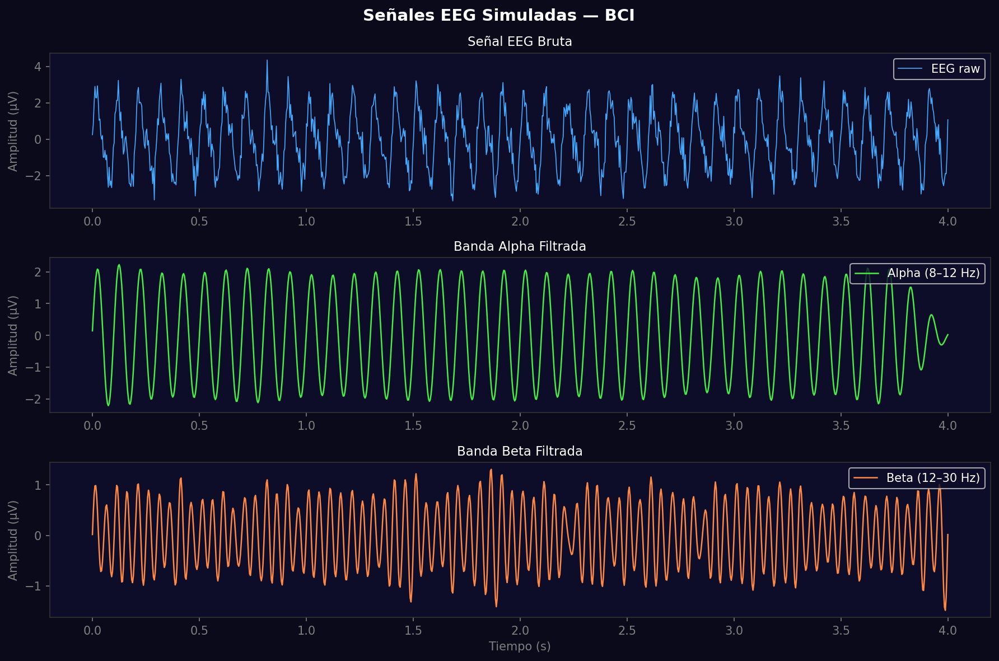
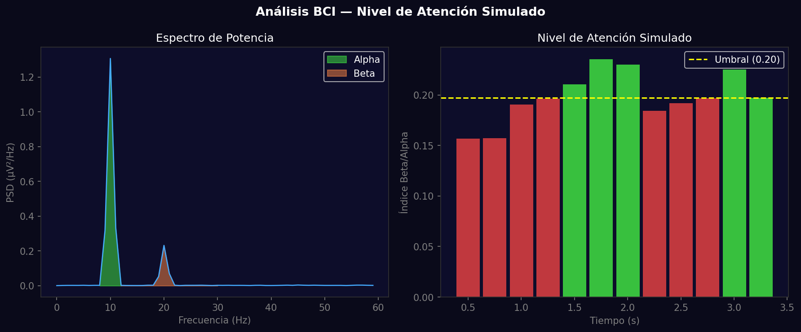

# Taller - BCI Simulado: Señales Mentales Artificiales para Control Visual

## Nombre del estudiante
Gabriel Andrés Anzola Tachak

## Fecha de entrega
`2026-05-29`

---

## Descripción breve

Este taller simula el procesamiento de señales **BCI (Brain-Computer Interface)** usando Python. Se genera una señal EEG sintética compuesta de ondas alpha (8–12 Hz) y beta (12–30 Hz) con ruido gaussiano. Se aplican filtros **pasa-banda Butterworth** de orden 4 para aislar cada banda de frecuencia. Finalmente, se calcula un "índice de atención" basado en la relación Beta/Alpha en ventanas temporales, y se compara contra un umbral para simular la activación de control visual.

---

## Implementaciones

### Python

**Herramientas:** `numpy`, `scipy.signal`, `matplotlib`

| Función | Descripción |
|---|---|
| Generación de EEG | Suma de sinusoides (alpha 10 Hz, beta 20 Hz) + ruido gaussiano |
| `scipy.signal.butter()` + `filtfilt()` | Filtro Butterworth pasa-banda de orden 4, aplicación sin desfase |
| `scipy.signal.welch()` | Estimación de densidad espectral de potencia (PSD) |
| `np.trapezoid()` | Integración numérica para calcular potencia por banda |
| Índice de atención | Ratio Beta_power / Alpha_power por ventanas de 1 segundo |

---

## Resultados visuales

### Python - Implementación


Señal EEG bruta y bandas alpha y beta filtradas por separado.


Espectro de potencia con bandas marcadas e índice de atención simulado a lo largo del tiempo.

---

## Código relevante

```python
def bandpass(data, low, high, fs):
    b, a = signal.butter(4, [low/(fs/2), high/(fs/2)], btype='band')
    return signal.filtfilt(b, a, data)

alpha_filtered = bandpass(eeg, 8, 12, fs)
beta_filtered = bandpass(eeg, 12, 30, fs)

# Calcular índice de atención por ventanas
for i in range(0, len(eeg) - window_size, window_size // 4):
    seg = eeg[i:i + window_size]
    freqs, psd = signal.welch(seg, fs, nperseg=window_size)
    alpha_power = np.trapezoid(psd[(freqs>=8)&(freqs<=12)], freqs[(freqs>=8)&(freqs<=12)])
    beta_power = np.trapezoid(psd[(freqs>=12)&(freqs<=30)], freqs[(freqs>=12)&(freqs<=30)])
    attention = beta_power / (alpha_power + 1e-6)
```

---

## Prompts utilizados

- "Simulate an EEG signal with alpha and beta components in Python, apply Butterworth bandpass filters, compute power spectrum with Welch method, and create an attention index from beta/alpha ratio"

---

## Aprendizajes y dificultades

### Aprendizajes
- `filtfilt` aplica el filtro en ambas direcciones para eliminar el desfase de fase.
- El método de Welch divide la señal en ventanas solapadas para estimar el PSD de forma más estable que FFT directa.
- La relación Beta/Alpha es un proxy simple de "estado de alerta" en BCI real.

### Dificultades
- `np.trapz` fue eliminado en NumPy 2.0; reemplazado por `np.trapezoid`.
- Las ventanas muy cortas dan estimaciones inestables del PSD; se requiere al menos 1 segundo (256 muestras a 256 Hz).

### Mejoras futuras
- Cargar datos EEG reales desde OpenBCI o el dataset EEG Eye State.
- Implementar retroalimentación visual interactiva con `pygame`.
- Agregar más bandas: theta (4–8 Hz), gamma (30+ Hz).

---

## Contribuciones grupales
Taller realizado de forma individual.

---

## Estructura del proyecto

```
semana_7_2_bci_simulado_control_visual/
├── python/
│   ├── semana_7_2.ipynb
│   └── generate_media.py
├── media/
│   ├── eeg_signals_filtered.png
│   └── bci_attention_analysis.png
└── README.md
```

---

## Referencias
- scipy.signal.butter: https://docs.scipy.org/doc/scipy/reference/generated/scipy.signal.butter.html
- EEG frequency bands: https://en.wikipedia.org/wiki/Electroencephalography#Frequency_bands
- OpenBCI: https://openbci.com/

---

## Checklist
- [x] Carpeta con nombre semana_7_2_bci_simulado_control_visual
- [x] Código limpio y funcional
- [x] GIFs/imágenes en media/ con nombres descriptivos
- [x] README completo con todas las secciones
- [x] Mínimo 2 capturas/GIFs por implementación
- [x] Commits descriptivos en inglés
