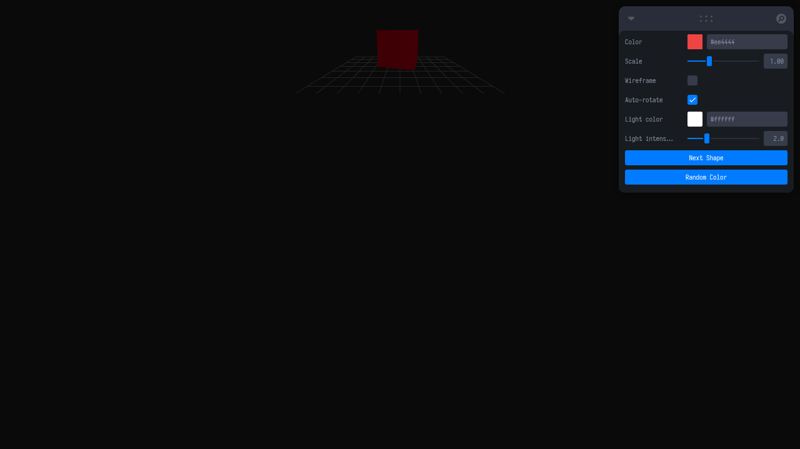

# Taller - Dashboards Visuales 3D: Sliders y Botones para Controlar Escenas

## Nombre del estudiante
Gabriel Andrés Anzola Tachak

## Fecha de entrega
`2026-05-29`

---

## Descripción breve

Este taller implementa un dashboard 3D interactivo en Three.js usando la biblioteca **leva** para controlar en tiempo real todas las propiedades de un objeto 3D: forma, color, escala, wireframe, rotación automática, color e intensidad de la luz. El usuario puede cambiar la geometría del objeto (cubo, esfera, torus, cilindro) y ajustar visualmente cada parámetro mediante sliders, pickers de color y botones, sin recargar la página.

---

## Implementaciones

### Three.js / React Three Fiber

| Componente / Hook | Funcionalidad |
|---|---|
| `useControls` (leva) | Panel de control con sliders (escala, intensidad de luz), picker de color, toggles (wireframe, auto-rotate) y botones de acción |
| `Scene` | Renderiza la geometría seleccionada con material `MeshStandard` reactivo a los controles |
| `button` (leva) | Botón "Next Shape" que cicla entre las 4 geometrías disponibles |
| `useFrame` | Rotación automática del objeto cuando `autoRotate` está activo |
| `pointLight` | Luz puntual con color e intensidad controlados desde el panel |

Stack: React 18 · Three.js 0.160 · @react-three/fiber 8.15 · @react-three/drei 9.90 · leva 0.9 · Vite 5.1

---

## Resultados visuales

### Three.js - Implementación


Dashboard con torus azul, panel de control leva visible con sliders de escala, color y luz.


Vista con wireframe activo y diferentes parámetros de luz aplicados.

---

## Código relevante

```jsx
const { color, scale, wireframe, autoRotate, lightColor, lightIntensity } = useControls({
  color: { value: '#e44', label: 'Color' },
  scale: { value: 1, min: 0.2, max: 3, step: 0.05, label: 'Scale' },
  wireframe: { value: false, label: 'Wireframe' },
  autoRotate: { value: true, label: 'Auto-rotate' },
  lightColor: { value: '#ffffff', label: 'Light color' },
  lightIntensity: { value: 2, min: 0, max: 8, step: 0.1, label: 'Light intensity' },
  'Next Shape': button(() => setShapeIdx(i => (i + 1) % SHAPES.length)),
});
```

---

## Prompts utilizados

- "Create a React Three Fiber dashboard with leva controls: color picker, scale slider, wireframe toggle, auto-rotate toggle, light color/intensity, and a button to cycle between box/sphere/torus/cylinder geometries"

---

## Aprendizajes y dificultades

### Aprendizajes
- `useControls` de leva retorna directamente los valores actualizados sin necesidad de `useState`.
- El objeto `button` de leva permite disparar callbacks como efectos secundarios desde el panel.
- `MeshStandardMaterial` acepta `wireframe` y `color` como props directas en JSX.

### Dificultades
- Los `button` de leva no pueden modificar valores de otros controles directamente; se necesita `useState` adicional para la forma.
- El picker de color de leva retorna strings hex que Three.js acepta directamente.

### Mejoras futuras
- Agregar control de posición de la cámara desde el panel.
- Implementar exportación de la escena como JSON o GLTF.
- Añadir múltiples objetos con controles independientes por objeto.

---

## Contribuciones grupales
Taller realizado de forma individual.

---

## Estructura del proyecto

```
semana_7_3_dashboards_visuales_3d_sliders_botones/
├── threejs/
│   ├── index.html
│   ├── package.json
│   ├── vite.config.js
│   └── src/
│       ├── main.jsx
│       ├── App.jsx
│       └── styles.css
├── media/
│   ├── dashboard_3d_overview.png
│   └── dashboard_3d_detail.png
└── README.md
```

---

## Referencias
- Leva docs: https://github.com/pmndrs/leva
- React Three Fiber: https://docs.pmnd.rs/react-three-fiber
- MeshStandardMaterial: https://threejs.org/docs/#api/en/materials/MeshStandardMaterial

---

## Checklist
- [x] Carpeta con nombre semana_7_3_dashboards_visuales_3d_sliders_botones
- [x] Código limpio y funcional
- [x] GIFs/imágenes en media/ con nombres descriptivos
- [x] README completo con todas las secciones
- [x] Mínimo 2 capturas/GIFs por implementación
- [x] Commits descriptivos en inglés
