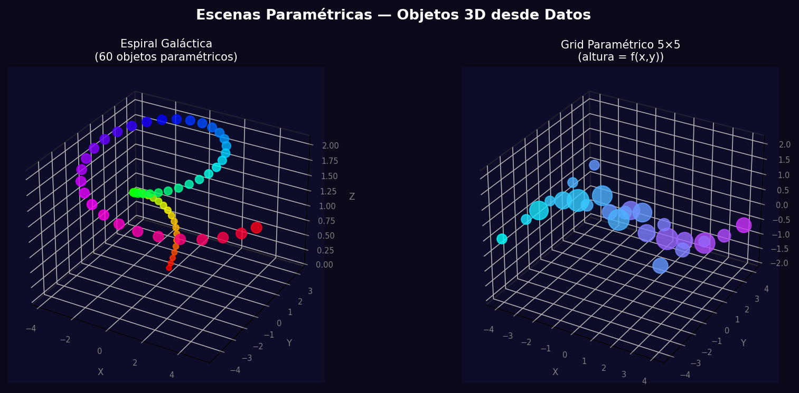
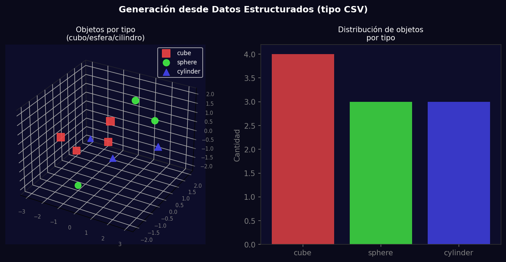
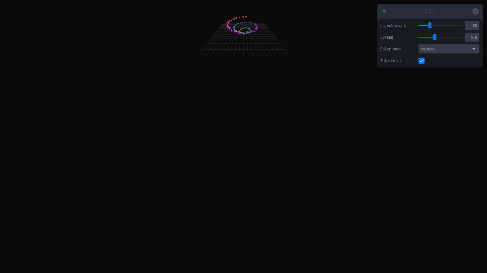

# Taller - Escenas Paramétricas: Creación de Objetos desde Datos

## Nombre del estudiante
Gabriel Andrés Anzola Tachak

## Fecha de entrega
`2026-05-29`

---

## Descripción breve

Este taller genera escenas 3D de forma programática a partir de listas de coordenadas y parámetros. En **Python** se crean espirales galácticas y grids de objetos parametrizados con `matplotlib` 3D. En **Three.js** se mapea un array de objetos donde posición, escala, color y rotación emergen de funciones matemáticas, con controles `leva` para ajustar los parámetros en tiempo real.

El enfoque paramétrico permite generar cientos de objetos instantáneamente cambiando solo unas pocas variables, demostrando el poder de la generación procedural de contenido 3D.

---

## Implementaciones

### Python

**Herramientas:** `numpy`, `matplotlib` (Axes3D)

| Función | Descripción |
|---|---|
| `spiral_stroke` | Genera puntos en espiral usando coordenadas polares paramétricas |
| Grid paramétrico | 5×5 objetos con altura = sin(i)·cos(j) y color = f(i+j) |
| Datos estructurados | Generación desde diccionario tipo CSV con tipo, posición y tamaño |

### Three.js / React Three Fiber

| Componente / Hook | Funcionalidad |
|---|---|
| `ParametricObjects` | Genera N objetos en espiral 3D usando `useMemo` para recalcular solo cuando cambian los parámetros |
| `useControls` (leva) | Sliders de conteo (10–300), spread (1–12), modo de color (rainbow/heat/cool) |
| `Array.from` + math | Calcula posición, tamaño y color de cada objeto desde funciones paramétricas |
| `useFrame` | Rotación lenta del grupo completo cuando `rotate` está activo |

Stack: React 18 · Three.js 0.160 · @react-three/fiber 8.15 · @react-three/drei 9.90 · leva 0.9 · Vite 5.1

---

## Resultados visuales

### Python - Implementación


Espiral galáctica de 60 objetos y grid paramétrico 5×5 con altura sinusoidal.


Generación de objetos desde datos estructurados con clasificación por tipo y distribución.

### Three.js - Implementación


80 objetos en espiral 3D con colores del espectro rainbow, controlados por leva.


Vista con modo de color "heat" y mayor densidad de objetos.

---

## Código relevante

```jsx
const objects = useMemo(() => {
  return Array.from({ length: count }, (_, i) => {
    const t = i / count;
    const angle = t * Math.PI * 2 * 3; // 3 vueltas
    const radius = t * spread;
    const x = Math.cos(angle) * radius;
    const z = Math.sin(angle) * radius;
    const y = (t - 0.5) * spread * 0.8;
    let color;
    if (colorMode === 'rainbow') color = new THREE.Color().setHSL(t, 0.9, 0.55);
    return { pos: [x, y, z], size: 0.15 + t * 0.4, color: '#'+color.getHexString(), shapeType: i%3 };
  });
}, [count, spread, colorMode]);
```

---

## Prompts utilizados

- "Generate parametric 3D scenes in Python with matplotlib: spiral galaxy and grid with sin/cos height function"
- "Create parametric objects in React Three Fiber: spiral arrangement with count/spread/colorMode leva controls"

---

## Aprendizajes y dificultades

### Aprendizajes
- `useMemo` es clave para evitar recalcular geometría en cada frame; solo recalcula cuando cambian las dependencias.
- Las coordenadas polares (r, θ) son la forma natural de generar espirales y distribuciones circulares.
- `THREE.Color().setHSL()` genera paletas de color continuas perfectas para datos paramétricos.

### Dificultades
- Renderizar 300 objetos React individuales puede degradar el FPS; para muchos objetos usar `InstancedMesh` es más eficiente.
- La exportación de escenas 3D desde Python a GLTF requiere bibliotecas adicionales (trimesh, open3d).

### Mejoras futuras
- Usar `InstancedMesh` de Three.js para renderizado de cientos de objetos sin costo de draw calls.
- Leer datos desde un archivo CSV real para generar escenas desde datos científicos.
- Agregar animaciones de transición cuando cambian los parámetros.

---

## Contribuciones grupales
Taller realizado de forma individual.

---

## Estructura del proyecto

```
semana_7_4_escenas_parametricas/
├── threejs/
│   ├── index.html
│   ├── package.json
│   ├── vite.config.js
│   └── src/
│       ├── main.jsx
│       ├── App.jsx
│       └── styles.css
├── python/
│   ├── semana_7_4.ipynb
│   └── generate_media.py
├── media/
│   ├── python_parametric_3d.png
│   ├── python_parametric_from_data.png
│   ├── parametric_scenes_overview.png
│   └── parametric_scenes_detail.png
└── README.md
```

---

## Referencias
- matplotlib 3D: https://matplotlib.org/stable/gallery/mplot3d/index.html
- THREE.Color HSL: https://threejs.org/docs/#api/en/math/Color.setHSL
- InstancedMesh: https://threejs.org/docs/#api/en/objects/InstancedMesh

---

## Checklist
- [x] Carpeta con nombre semana_7_4_escenas_parametricas
- [x] Código limpio y funcional
- [x] GIFs/imágenes en media/ con nombres descriptivos
- [x] README completo con todas las secciones
- [x] Mínimo 2 capturas/GIFs por implementación
- [x] Commits descriptivos en inglés
