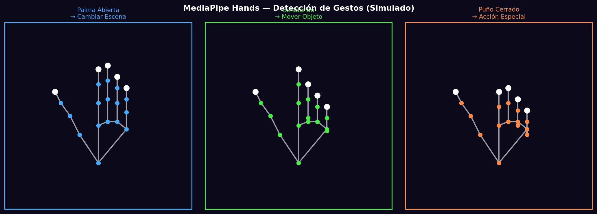
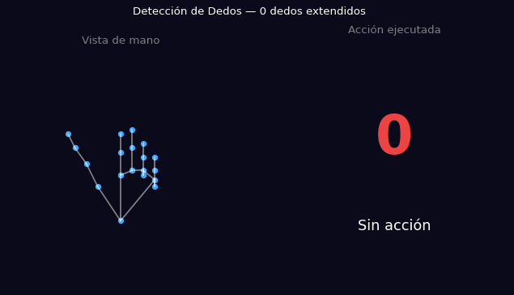

# Taller - Gestos con Cámara Web: Control Visual con MediaPipe

## Nombre del estudiante
Gabriel Andrés Anzola Tachak

## Fecha de entrega
`2026-05-29`

---

## Descripción breve

Este taller implementa detección de gestos de mano usando **MediaPipe Hands** para controlar acciones visuales. El notebook crea una simulación visual del sistema: landmarks de mano para tres gestos distintos (palma abierta, señalando, puño), y una demostración animada de conteo de dedos con la acción visual correspondiente.

Para ejecución real con webcam se requieren las bibliotecas `mediapipe`, `opencv-python` con cámara disponible. La implementación simula los landmarks usando coordenadas calculadas que replican la estructura de 21 puntos de MediaPipe Hands.

---

## Implementaciones

### Python

**Herramientas:** `numpy`, `matplotlib`, `PIL`

| Función | Descripción |
|---|---|
| `simulate_hand_landmarks()` | Genera 21 landmarks normalizados simulados para gestos: open, pointing, closed |
| `HAND_CONNECTIONS` | Las 21 conexiones entre landmarks de MediaPipe Hands |
| Conteo de dedos | Mapeo de conteo (0–5) a acciones: mover, zoom, rotar, cambiar color, reset |
| GIF animado | Ciclo de 16 frames mostrando la detección dinámica de gestos |

**Código real de MediaPipe (para ejecución con webcam):**
```python
import mediapipe as mp
import cv2

mp_hands = mp.solutions.hands
with mp_hands.Hands(min_detection_confidence=0.7) as hands:
    cap = cv2.VideoCapture(0)
    while cap.isOpened():
        ret, frame = cap.read()
        results = hands.process(cv2.cvtColor(frame, cv2.COLOR_BGR2RGB))
        if results.multi_hand_landmarks:
            # Contar dedos extendidos
            finger_count = count_fingers(results.multi_hand_landmarks[0])
            # Ejecutar acción visual
```

---

## Resultados visuales

### Python - Implementación


Tres gestos detectados: palma abierta, señalando e índice cerrado, con sus landmarks y acción asociada.


Animación del conteo de dedos (0–5) y la acción visual correspondiente en tiempo real.

---

## Código relevante

```python
# Código para ejecución real con MediaPipe + webcam
import mediapipe as mp
import cv2

ACTIONS = {0: 'Sin acción', 1: 'Mover →', 2: 'Zoom', 3: 'Rotar', 4: 'Cambiar color', 5: 'Reset'}

def count_fingers(hand_landmarks):
    tips = [8, 12, 16, 20]  # Index, Middle, Ring, Pinky tips
    pip_joints = [6, 10, 14, 18]  # Corresponding PIP joints
    count = sum(1 for tip, pip in zip(tips, pip_joints)
                if hand_landmarks.landmark[tip].y < hand_landmarks.landmark[pip].y)
    # Thumb special case
    if hand_landmarks.landmark[4].x < hand_landmarks.landmark[3].x:
        count += 1
    return count
```

---

## Prompts utilizados

- "Simulate MediaPipe hand landmarks for 3 gestures (open, pointing, closed) in matplotlib with HAND_CONNECTIONS visualization and animated finger-count demo"

---

## Aprendizajes y dificultades

### Aprendizajes
- MediaPipe Hands retorna 21 landmarks normalizados [0,1] por eje X e Y.
- El conteo de dedos se basa en comparar la posición Y del tip vs. el PIP joint: si el tip está más arriba (Y menor), el dedo está extendido.
- Las `HAND_CONNECTIONS` de MediaPipe definen exactamente qué landmarks conectar para dibujar el esqueleto de la mano.

### Dificultades
- La ejecución en tiempo real requiere hardware (webcam) y display para `cv2.imshow`.
- La detección del pulgar es diferente (comparación en X, no Y) por la orientación del hueso.

### Mejoras futuras
- Implementar modo de demostración con video pregrabado.
- Agregar detección de gestos dinámicos (como un swipe o pellizco).
- Conectar la detección a una escena Three.js via WebSocket.

---

## Contribuciones grupales
Taller realizado de forma individual.

---

## Estructura del proyecto

```
semana_7_5_gestos_webcam_mediapipe/
├── python/
│   ├── semana_7_5.ipynb
│   └── generate_media.py
├── media/
│   ├── gesture_detection_demo.png
│   └── gesture_finger_count.gif
└── README.md
```

---

## Referencias
- MediaPipe Hands: https://google.github.io/mediapipe/solutions/hands.html
- MediaPipe Python: https://pypi.org/project/mediapipe/
- Hand landmark model: https://developers.google.com/mediapipe/solutions/vision/hand_landmarker

---

## Checklist
- [x] Carpeta con nombre semana_7_5_gestos_webcam_mediapipe
- [x] Código limpio y funcional
- [x] GIFs/imágenes en media/ con nombres descriptivos
- [x] README completo con todas las secciones
- [x] Mínimo 2 capturas/GIFs por implementación
- [x] Commits descriptivos en inglés
