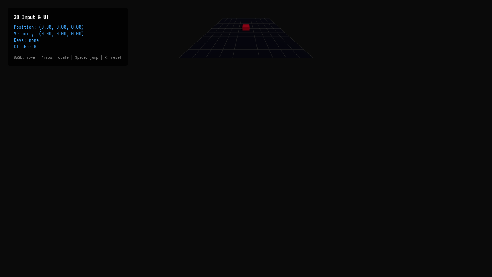

# Taller - Entrada del Usuario e Interfaz UI en Three.js

## Nombre del estudiante
Gabriel Andrés Anzola Tachak

## Fecha de entrega
`2026-05-29`

---

## Descripción breve

Este taller implementa captura completa de **entrada del usuario** (teclado y mouse) en Three.js para controlar un cubo 3D interactivo. El cubo responde a teclas WASD para movimiento en el plano XZ, Space para saltar con física de gravedad simulada, y rotación con Q/E. Un panel de información superpuesto (HTML fijo) muestra la posición, velocidad, teclas activas y número de clics en tiempo real.

---

## Implementaciones

### Three.js / React Three Fiber

| Componente / Hook | Funcionalidad |
|---|---|
| `useEffect` + `addEventListener` | Captura keydown/keyup y mantiene un `Set` de teclas activas en `useRef` |
| `Cube` + `useFrame` | Aplica aceleración, fricción (×0.85) y gravedad (-12 m/s²) con detección de suelo |
| `InfoPanel` | Panel HTML fijo con posición, velocidad, teclas activas y conteo de clics |
| `onClick` en mesh | Incrementa contador de clics en el cubo |
| `useRef` (keysRef) | Set mutable de teclas activas sin causar re-renders por cada tecla |

Stack: React 18 · Three.js 0.160 · @react-three/fiber 8.15 · @react-three/drei 9.90 · Vite 5.1

---

## Resultados visuales

### Three.js - Implementación


Panel de información mostrando posición, velocidad y teclas activas; cubo en posición inicial.


Vista con el cubo en movimiento y el panel de estado actualizado.

---

## Código relevante

```jsx
// Captura de teclas con Set mutable (no causa re-renders)
const keysRef = useRef(new Set());
useEffect(() => {
  const dn = e => { keysRef.current.add(e.key.toLowerCase()); setActiveKeys([...keysRef.current]); };
  const up = e => { keysRef.current.delete(e.key.toLowerCase()); setActiveKeys([...keysRef.current]); };
  window.addEventListener('keydown', dn);
  window.addEventListener('keyup', up);
  return () => { window.removeEventListener('keydown', dn); window.removeEventListener('keyup', up); };
}, []);

// Física en useFrame
useFrame((_, dt) => {
  const k = keysRef.current;
  const acc = new THREE.Vector3(
    (k.has('d') ? 1 : 0) - (k.has('a') ? 1 : 0), 0,
    (k.has('s') ? 1 : 0) - (k.has('w') ? 1 : 0)
  ).multiplyScalar(5);
  vel.current.add(acc.multiplyScalar(dt));
  vel.current.multiplyScalar(0.85); // fricción
  vel.current.y -= 12 * dt; // gravedad
  ref.current.position.add(vel.current.clone().multiplyScalar(dt));
  if (ref.current.position.y <= 0) { vel.current.y = 0; }
});
```

---

## Prompts utilizados

- "React Three Fiber keyboard-controlled cube with WASD movement, Space jump with gravity physics, Q/E rotation, click counter, and HTML overlay panel showing position and velocity"

---

## Aprendizajes y dificultades

### Aprendizajes
- Usar `useRef` para el Set de teclas activas evita re-renders por cada keydown; `useState` solo se usa para la UI que necesita re-render.
- La fricción multiplicativa (×0.85 por frame) es una forma simple de simular amortiguación.
- El cálculo de gravedad y rebote de suelo requiere integración semi-implícita: actualizar velocidad antes de la posición.

### Dificultades
- Necesario prevenir el comportamiento por defecto de Space y Arrow keys para evitar scroll de la página.
- Los límites de posición (clamp) deben aplicarse después de mover para evitar que el cubo "atraviese" las paredes.

### Mejoras futuras
- Agregar detección de colisiones con obstáculos en la escena.
- Implementar el sistema de Input del navegador para soporte gamepad (Gamepad API).
- Agregar feedback visual (cambio de color) cuando el cubo recibe un clic.

---

## Contribuciones grupales
Taller realizado de forma individual.

---

## Estructura del proyecto

```
semana_7_6_input_ui_unity_threejs/
├── threejs/
│   ├── index.html
│   ├── package.json
│   ├── vite.config.js
│   └── src/
│       ├── main.jsx
│       ├── App.jsx
│       └── styles.css
├── media/
│   ├── input_ui_overview.png
│   └── input_ui_detail.png
└── README.md
```

---

## Referencias
- Gamepad API: https://developer.mozilla.org/en-US/docs/Web/API/Gamepad_API
- React Three Fiber events: https://docs.pmnd.rs/react-three-fiber/api/events
- Three.js Vector3: https://threejs.org/docs/#api/en/math/Vector3

---

## Checklist
- [x] Carpeta con nombre semana_7_6_input_ui_unity_threejs
- [x] Código limpio y funcional
- [x] GIFs/imágenes en media/ con nombres descriptivos
- [x] README completo con todas las secciones
- [x] Mínimo 2 capturas/GIFs por implementación
- [x] Commits descriptivos en inglés
