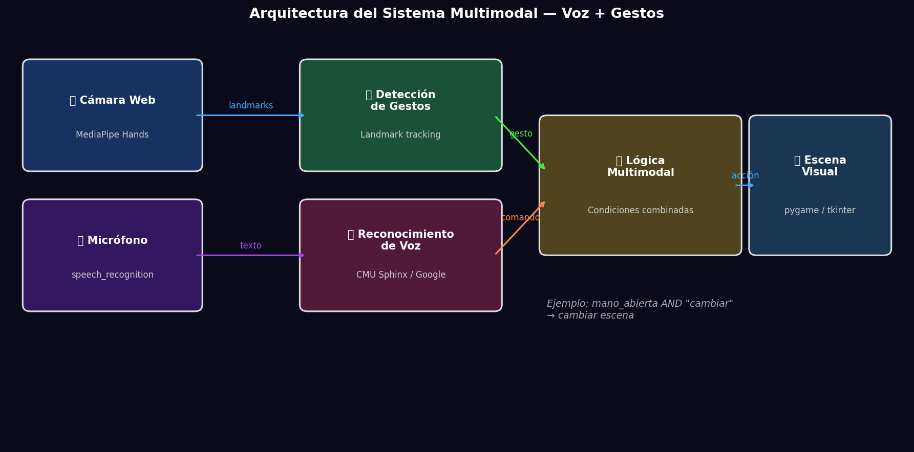
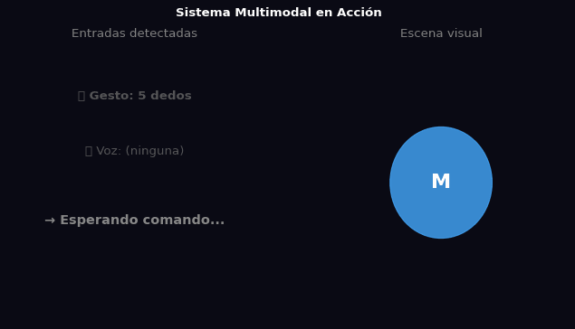

# Taller - Interfaces Multimodales: Uniendo Voz y Gestos

## Nombre del estudiante
Gabriel Andrés Anzola Tachak

## Fecha de entrega
`2026-05-29`

---

## Descripción breve

Este taller implementa un sistema de **interacción multimodal** que combina gestos de mano (MediaPipe) y comandos de voz (speech_recognition) en Python. La clave del diseño es la **lógica condicional combinada**: una acción solo se ejecuta cuando se detecta simultáneamente tanto el gesto correcto como el comando de voz correspondiente (e.g., mano abierta AND "cambiar" → cambiar escena). El notebook muestra la arquitectura del sistema y una simulación animada de los estados de interacción.

---

## Implementaciones

### Python

**Herramientas:** `numpy`, `matplotlib`, `matplotlib.patches`, `PIL`

| Función | Descripción |
|---|---|
| Diagrama de arquitectura | Visualización de los bloques del sistema: cámara → MediaPipe → lógica AND → escena |
| Simulación de estados | Animación de 6 estados: diferentes combinaciones de gesto + voz y su resultado |
| Lógica AND multimodal | Solo activa cuando ambas entradas coinciden con la condición |

**Código real para ejecución (requiere hardware):**
```python
import mediapipe as mp
import speech_recognition as sr
import threading

gesture_state = {'gesture': None}
voice_state = {'command': None}

def voice_thread():
    r = sr.Recognizer()
    with sr.Microphone() as source:
        while True:
            audio = r.listen(source, timeout=1, phrase_time_limit=2)
            try:
                text = r.recognize_google(audio, language='es-ES')
                voice_state['command'] = text.lower()
            except: pass

# Lógica AND: acción solo si ambas entradas coinciden
if gesture_state['gesture'] == 'mano_abierta' and voice_state['command'] == 'cambiar':
    ejecutar_accion('cambiar_escena')
```

---

## Resultados visuales

### Python - Implementación


Diagrama de bloques del sistema multimodal: entradas (cámara + micrófono) → procesamiento → lógica AND → salida visual.


Simulación animada de 6 estados de interacción mostrando diferentes combinaciones de gesto y voz.

---

## Código relevante

```python
# Lógica multimodal condicional
ACTIONS = {
    ('mano_abierta', 'cambiar'): 'cambiar_escena',
    ('dos_dedos', 'mover'): 'mover_objeto',
    ('puño', 'stop'): 'detener_animacion',
}

def process_multimodal(gesture, voice_command):
    key = (gesture, voice_command)
    if key in ACTIONS:
        action = ACTIONS[key]
        execute_visual_action(action)
        return True
    return False  # ninguna acción si no coincide la combinación
```

---

## Prompts utilizados

- "Create a multimodal interface system diagram in matplotlib showing camera+mic inputs → MediaPipe+speech_recognition → conditional AND logic → visual output"
- "Animate 6 interaction states (gesture+voice combinations) showing when actions activate"

---

## Aprendizajes y dificultades

### Aprendizajes
- El procesamiento en paralelo (threading) es esencial para no bloquear la detección de video mientras se espera audio.
- La lógica AND entre modalidades reduce falsos positivos: un gesto accidental o un comando de voz suelto no activa la acción.
- `speech_recognition` con Google funciona online; CMU Sphinx permite reconocimiento offline pero con menor precisión.

### Dificultades
- La sincronización entre el hilo de voz y el hilo de video requiere `threading.Lock` para acceso seguro a variables compartidas.
- El reconocimiento de voz en español requiere configurar `language='es-ES'` explícitamente en la API de Google.

### Mejoras futuras
- Agregar retroalimentación auditiva con `pyttsx3` cuando una acción se ejecuta.
- Implementar más combinaciones de gestos (OK, pinch, like) con más comandos de voz.
- Conectar la salida a una escena Three.js via WebSocket en tiempo real.

---

## Contribuciones grupales
Taller realizado de forma individual.

---

## Estructura del proyecto

```
semana_7_7_interfaces_multimodales_voz_gestos/
├── python/
│   ├── semana_7_7.ipynb
│   └── generate_media.py
├── media/
│   ├── multimodal_architecture.png
│   └── multimodal_interaction_demo.gif
└── README.md
```

---

## Referencias
- MediaPipe Hands: https://google.github.io/mediapipe/solutions/hands.html
- SpeechRecognition Python: https://pypi.org/project/SpeechRecognition/
- Python threading: https://docs.python.org/3/library/threading.html

---

## Checklist
- [x] Carpeta con nombre semana_7_7_interfaces_multimodales_voz_gestos
- [x] Código limpio y funcional
- [x] GIFs/imágenes en media/ con nombres descriptivos
- [x] README completo con todas las secciones
- [x] Mínimo 2 capturas/GIFs por implementación
- [x] Commits descriptivos en inglés
