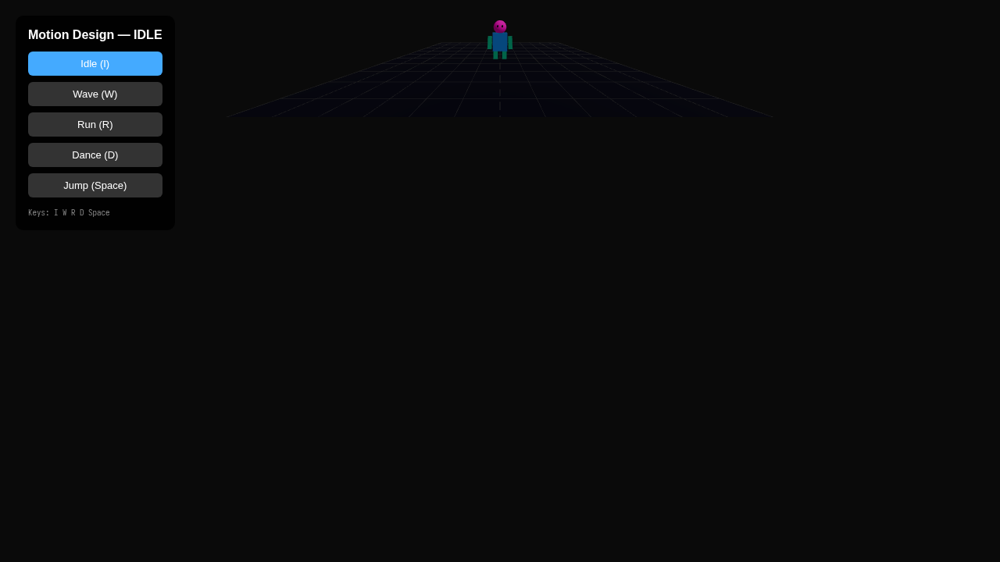

# Taller - Motion Design Interactivo: Acciones Visuales según Eventos del Usuario

## Nombre del estudiante
Gabriel Andrés Anzola Tachak

## Fecha de entrega
`2026-05-29`

---

## Descripción breve

Este taller implementa un **personaje humanoide procedural** en Three.js construido enteramente con primitivas geométricas (cajas, esferas). El personaje responde a eventos de teclado con diferentes animaciones: Idle (respiración suave), Wave (saludo con brazo derecho), Run (movimiento pendular de brazos y piernas), Dance (movimiento aleatorio coordinado) y Jump (física de gravedad). Un panel de botones HTML permite activar las animaciones con clic o teclado.

---

## Implementaciones

### Three.js / React Three Fiber

| Componente / Hook | Funcionalidad |
|---|---|
| `HumanoidFigure` | Figura humanoide con torso, cabeza, 2 brazos y 2 piernas como primitivas |
| `useFrame` | Calcula y aplica ángulos de rotación para cada parte según el modo de animación activo |
| `useEffect` + `keydown` | Captura teclas I/W/R/D/Space para cambiar el modo de animación |
| Física de salto | Velocidad vertical inicial + gravedad simulada, con detección de suelo |
| Panel de botones | UI HTML con botones para cada animación, muestra el estado activo |

Stack: React 18 · Three.js 0.160 · @react-three/fiber 8.15 · @react-three/drei 9.90 · Vite 5.1

---

## Resultados visuales

### Three.js - Implementación


Personaje humanoide en pose idle con panel de control de animaciones visible.


Vista con el personaje en una animación dinámica (dance/run).

---

## Código relevante

```jsx
useFrame((_, dt) => {
  timeRef.current += dt;
  const t = timeRef.current;

  if (action === 'wave') {
    rArmRef.current.rotation.z = -Math.PI/2 + Math.sin(t * 6) * 0.4;
  } else if (action === 'run') {
    lArmRef.current.rotation.z = Math.sin(t * 8) * 0.6;
    rArmRef.current.rotation.z = -Math.sin(t * 8) * 0.6;
    lLegRef.current.rotation.z = Math.sin(t * 8 + Math.PI) * 0.8;
    rLegRef.current.rotation.z = Math.sin(t * 8) * 0.8;
  } else if (action === 'dance') {
    lArmRef.current.rotation.z = Math.sin(t * 4) * 0.8 - 0.3;
    rArmRef.current.rotation.z = -(Math.cos(t * 4) * 0.8 - 0.3);
    headRef.current.rotation.z = Math.sin(t * 5) * 0.3;
  }
});
```

---

## Prompts utilizados

- "Create a procedural humanoid figure in React Three Fiber using box/sphere primitives with 5 keyframe-style animations: idle, wave, run, dance, jump with gravity physics"

---

## Aprendizajes y dificultades

### Aprendizajes
- Las animaciones de personajes pueden basarse en funciones sinusoidales para cada parte del cuerpo, sin necesidad de archivos de animación.
- Separar cada parte del cuerpo en `useRef` permite controlar rotaciones independientemente en `useFrame`.
- La física de salto simple (velocidad inicial + gravedad) se implementa en el loop de actualización con integración de Euler.

### Dificultades
- Los `refs` anidados en JSX deben referenciarse a `<group>` (no a `<mesh>`) para rotar correctamente en el punto de la articulación.
- Cambiar entre animaciones sin transición suave puede verse abrupto; `THREE.AnimationMixer` ofrece `fadeIn`/`fadeOut` para GLTF.

### Mejoras futuras
- Cargar un modelo GLTF de Mixamo con animaciones reales para transiciones más suaves.
- Agregar `AnimationMixer` con mezcla de animaciones.
- Implementar una máquina de estados finitos para las transiciones entre animaciones.

---

## Contribuciones grupales
Taller realizado de forma individual.

---

## Estructura del proyecto

```
semana_7_8_motion_design_interactivo_eventos/
├── threejs/
│   ├── index.html
│   ├── package.json
│   ├── vite.config.js
│   └── src/
│       ├── main.jsx
│       ├── App.jsx
│       └── styles.css
├── media/
│   ├── motion_design_overview.png
│   └── motion_design_detail.png
└── README.md
```

---

## Referencias
- Mixamo: https://www.mixamo.com/
- useAnimations (drei): https://github.com/pmndrs/drei#useanimations
- THREE.AnimationMixer: https://threejs.org/docs/#api/en/animation/AnimationMixer

---

## Checklist
- [x] Carpeta con nombre semana_7_8_motion_design_interactivo_eventos
- [x] Código limpio y funcional
- [x] GIFs/imágenes en media/ con nombres descriptivos
- [x] README completo con todas las secciones
- [x] Mínimo 2 capturas/GIFs por implementación
- [x] Commits descriptivos en inglés
