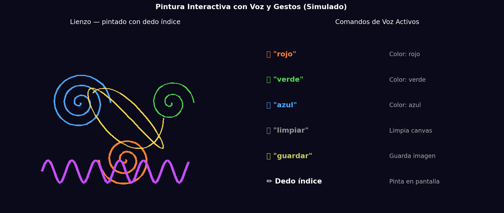
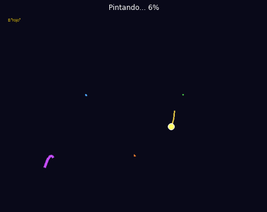

# Taller - Obras Interactivas: Pintando con Voz y Gestos

## Nombre del estudiante
Gabriel Andrés Anzola Tachak

## Fecha de entrega
`2026-05-29`

---

## Descripción breve

Este taller implementa un sistema de **pintura interactiva** controlado por gestos de mano (MediaPipe) y comandos de voz (speech_recognition). El dedo índice actúa como pincel, trazando en tiempo real sobre un lienzo digital. Los comandos de voz cambian el color ("rojo", "verde", "azul"), limpian el lienzo ("limpiar") o guardan la obra ("guardar"). El notebook simula el sistema generando trazos espirales de múltiples colores y visualizando el progreso del "pintado".

---

## Implementaciones

### Python

**Herramientas:** `numpy`, `matplotlib`, `PIL`

| Función | Descripción |
|---|---|
| `make_canvas_frame()` | Renderiza el lienzo como imagen PIL con los trazos actuales usando `ImageDraw.line()` |
| `spiral_stroke()` | Genera trayectorias de pincel en espiral para la simulación |
| GIF animado | 16 frames mostrando el progreso del pintado con marcador del dedo índice |
| Panel de comandos | Visualización de los comandos de voz disponibles y sus efectos |

**Código real para ejecución (requiere webcam + micrófono):**
```python
import mediapipe as mp
import cv2, speech_recognition as sr

def get_brush_pos(landmarks):
    index_tip = landmarks.landmark[8]
    return (int(index_tip.x * W), int(index_tip.y * H))

def listen_command():
    r = sr.Recognizer()
    with sr.Microphone() as source:
        audio = r.listen(source, timeout=0.5)
        return r.recognize_google(audio, language='es-ES').lower()
```

---

## Resultados visuales

### Python - Implementación


Lienzo con cinco trazos de colores diferentes generados por el "dedo índice" virtual, con panel de comandos de voz.


Animación del proceso de pintado en 16 etapas, mostrando el marcador del dedo y los trazos acumulándose.

---

## Código relevante

```python
# Código real para pintura con MediaPipe + OpenCV
import cv2
import mediapipe as mp

canvas = np.zeros((H, W, 3), dtype=np.uint8)
brush_color = (78, 170, 255)  # Azul por defecto
prev_pos = None

mp_hands = mp.solutions.hands
with mp_hands.Hands() as hands:
    cap = cv2.VideoCapture(0)
    while True:
        ret, frame = cap.read()
        results = hands.process(cv2.cvtColor(frame, cv2.COLOR_BGR2RGB))
        if results.multi_hand_landmarks:
            tip = results.multi_hand_landmarks[0].landmark[8]
            pos = (int(tip.x * W), int(tip.y * H))
            if prev_pos:
                cv2.line(canvas, prev_pos, pos, brush_color, 5)
            prev_pos = pos
        combined = cv2.addWeighted(frame, 0.3, canvas, 0.7, 0)
        cv2.imshow('Pintura', combined)
```

---

## Prompts utilizados

- "Simulate interactive painting with hand gesture tracking in matplotlib: spiral brush strokes, animated progress GIF, voice command panel"

---

## Aprendizajes y dificultades

### Aprendizajes
- `cv2.addWeighted` permite superponer el lienzo de pintura sobre el frame de la cámara con transparencia ajustable.
- Los trazos se acumulan dibujando líneas entre la posición previa y la actual del dedo índice (landmark 8 de MediaPipe).
- Los comandos de voz se pueden procesar en un hilo separado para no bloquear el loop de video.

### Dificultades
- La sincronización entre el hilo de audio y el loop de video principal requiere `queue.Queue` para pasar comandos de forma segura.
- El reconocimiento de voz tiene latencia (~0.5-2 s) que introduce retrasos en la respuesta del color.

### Mejoras futuras
- Agregar tipos de pinceles (círculo, cuadrado, estrella) controlados por gestos.
- Implementar deshacer (`Ctrl+Z`) con un historial de estados del lienzo.
- Exportar la obra como SVG con los trazos como paths vectoriales.

---

## Contribuciones grupales
Taller realizado de forma individual.

---

## Estructura del proyecto

```
semana_7_9_pintura_interactiva_voz_gestos/
├── python/
│   ├── semana_7_9.ipynb
│   └── generate_media.py
├── media/
│   ├── painting_canvas_result.png
│   └── painting_process.gif
└── README.md
```

---

## Referencias
- MediaPipe Hands landmarks: https://google.github.io/mediapipe/solutions/hands.html#hand-landmark-model
- OpenCV drawing: https://docs.opencv.org/4.x/d6/d6e/group__imgproc__draw.html
- SpeechRecognition: https://pypi.org/project/SpeechRecognition/

---

## Checklist
- [x] Carpeta con nombre semana_7_9_pintura_interactiva_voz_gestos
- [x] Código limpio y funcional
- [x] GIFs/imágenes en media/ con nombres descriptivos
- [x] README completo con todas las secciones
- [x] Mínimo 2 capturas/GIFs por implementación
- [x] Commits descriptivos en inglés
