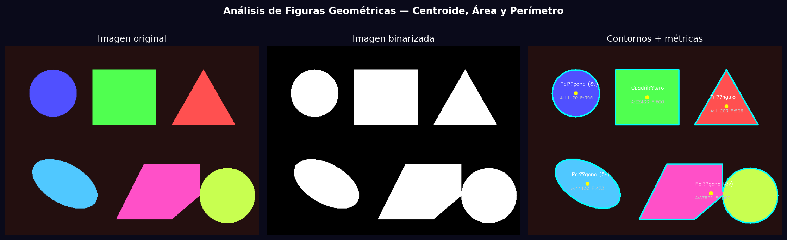
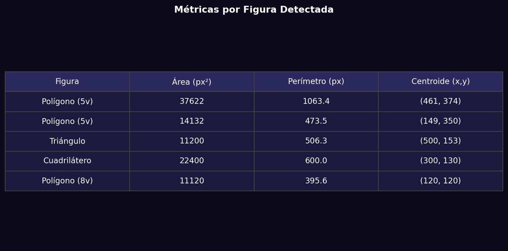

# Taller - Análisis de Figuras Geométricas: Centroide, Área y Perímetro

## Nombre del estudiante
Gabriel Andrés Anzola Tachak

## Fecha de entrega
`2026-05-29`

---

## Descripción breve

Detección de contornos en imágenes binarizadas con `cv2.findContours()` y cálculo de propiedades geométricas: área (`cv2.contourArea()`), perímetro (`cv2.arcLength()`), centroide (momentos `cv2.moments()`). Las figuras se clasifican automáticamente según el número de vértices de su polígono aproximado (`cv2.approxPolyDP()`).

---

## Implementaciones

### Python

**Herramientas:** `opencv-python`, `numpy`, `matplotlib`

| Función | Descripción |
|---|---|
| `cv2.threshold()` | Binarización de imagen sintética con 6 formas geométricas |
| `cv2.findContours()` | Detección de contornos externos |
| `cv2.contourArea()` / `cv2.arcLength()` | Área y perímetro de cada contorno |
| `cv2.moments()` | Cálculo del centroide (cx=M10/M00, cy=M01/M00) |
| `cv2.approxPolyDP()` | Clasificación por número de vértices: triángulo/cuadrilátero/círculo |

---

## Resultados visuales

### Python - Implementación


Imagen original, versión binarizada y contornos con métricas superpuestas.


Tabla con área, perímetro y coordenadas de centroide para cada figura detectada.

---

## Código relevante

```python
contours, _ = cv2.findContours(binary, cv2.RETR_EXTERNAL, cv2.CHAIN_APPROX_SIMPLE)
for cnt in contours:
    area = cv2.contourArea(cnt)
    perimeter = cv2.arcLength(cnt, True)
    M = cv2.moments(cnt)
    cx = int(M['m10'] / M['m00']); cy = int(M['m01'] / M['m00'])
    approx = cv2.approxPolyDP(cnt, 0.04 * perimeter, True)
    n_verts = len(approx)  # 3=triángulo, 4=cuadrilátero, más=círculo
```

---

## Prompts utilizados

- "Detect contours on a synthetic image with circles, rectangles and triangles, compute area/perimeter/centroid for each, classify shapes by vertex count"

---

## Aprendizajes y dificultades

### Aprendizajes
- `cv2.moments()` calcula hasta orden 3 para cada contorno; el centroide es siempre m10/m00, m01/m00.
- `cv2.approxPolyDP()` con epsilon = 4% del perímetro clasifica bien las formas básicas.
- `cv2.RETR_EXTERNAL` devuelve solo los contornos más externos (ignora huecos internos).

### Dificultades
- Las formas con ruido o edges ruidosos generan contornos fragmentados; hay que filtrar por área mínima.

### Mejoras futuras
- Agregar momentos de Hu para clasificación invariante a escala/rotación.
- Procesar imágenes reales de objetos cotidianos.

---

## Contribuciones grupales
Taller realizado de forma individual.

---

## Estructura del proyecto

```
semana_9_1_analisis_figuras_geometricas/
├── python/
│   ├── semana_9_1.ipynb
│   └── generate_media.py
├── media/
│   ├── geometric_analysis.png
│   └── shape_metrics_table.png
└── README.md
```

---

## Referencias
- cv2.findContours: https://docs.opencv.org/4.x/d3/dc0/group__imgproc__shape.html
- cv2.moments: https://docs.opencv.org/4.x/d8/d23/classcv_1_1Moments.html

---

## Checklist
- [x] Carpeta con nombre semana_9_1_analisis_figuras_geometricas
- [x] Código limpio y funcional
- [x] GIFs/imágenes en media/ con nombres descriptivos
- [x] README completo con todas las secciones
- [x] Mínimo 2 capturas/GIFs por implementación
- [x] Commits descriptivos en inglés
