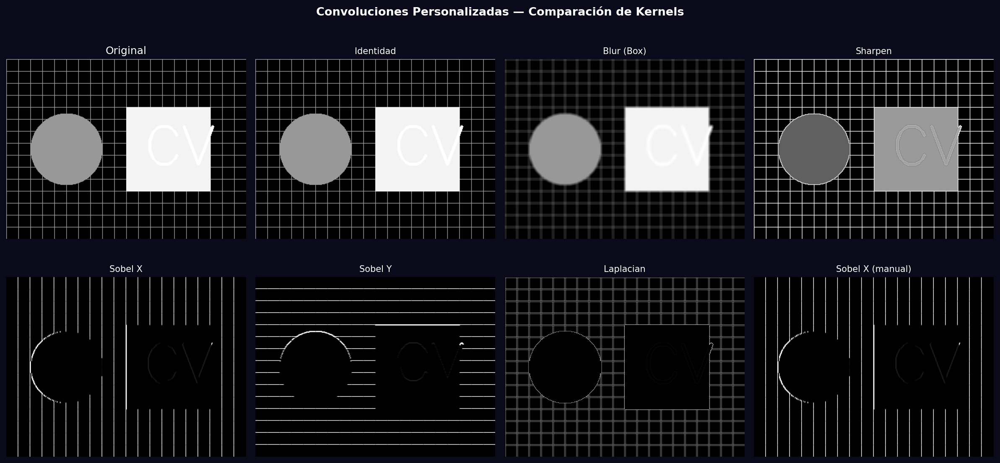
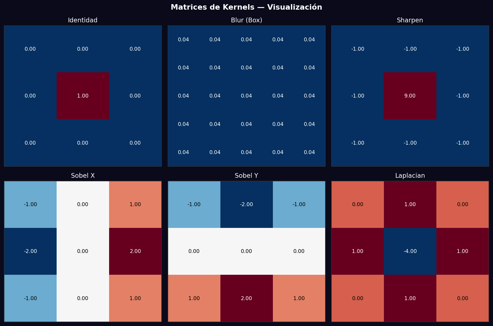

# Taller - Filtro Visual: Convoluciones Personalizadas

## Nombre del estudiante
Gabriel Andrés Anzola Tachak

## Fecha de entrega
`2026-05-29`

---

## Descripción breve

Implementación de convoluciones 2D desde cero con NumPy y comparación con `cv2.filter2D()`. Se diseñan y aplican 6 kernels distintos: identidad, box blur, sharpening, Sobel X, Sobel Y y Laplaciano. La implementación manual itera sobre cada píxel aplicando el kernel, validando que los resultados coincidan con los de OpenCV.

---

## Implementaciones

### Python

**Herramientas:** `opencv-python`, `numpy`, `matplotlib`

| Función | Descripción |
|---|---|
| `convolve2d_manual()` | Convolución 2D desde cero con padding edge y doble loop |
| `cv2.filter2D()` | Versión optimizada de OpenCV para comparación |
| Kernels diseñados | Identidad, Box Blur, Sharpen, Sobel X/Y, Laplaciano |
| Visualización de matrices | Heatmap de los valores de cada kernel con anotaciones numéricas |

---

## Resultados visuales

### Python - Implementación


Aplicación de 6 kernels sobre imagen de prueba: identidad, blur, sharpen, Sobel X/Y, Laplaciano.


Visualización de las matrices de cada kernel con valores anotados y heatmap de color.

---

## Código relevante

```python
def convolve2d_manual(image, kernel):
    kh, kw = kernel.shape
    pad_h, pad_w = kh // 2, kw // 2
    padded = np.pad(image, ((pad_h, pad_h), (pad_w, pad_w)), mode='edge')
    result = np.zeros_like(image)
    for i in range(image.shape[0]):
        for j in range(image.shape[1]):
            result[i, j] = np.sum(padded[i:i+kh, j:j+kw] * kernel)
    return np.clip(result, 0, 1)

kernels = {
    'Sharpen': np.array([[-1,-1,-1],[-1,9,-1],[-1,-1,-1]], np.float32),
    'Sobel X': np.array([[-1,0,1],[-2,0,2],[-1,0,1]], np.float32),
}
```

---

## Prompts utilizados

- "Implement 2D convolution from scratch in Python with NumPy, compare with cv2.filter2D for 6 kernels: identity, blur, sharpen, Sobel X/Y, Laplacian"

---

## Aprendizajes y dificultades

### Aprendizajes
- El padding 'edge' replica los píxeles del borde para evitar artefactos en los extremos.
- Los kernels de Sobel y Laplaciano tienen valores negativos; el resultado debe normalizarse con `np.abs()` para visualizarse.
- `cv2.filter2D()` es 100-1000x más rápido que la implementación Python pura (OpenCV usa SIMD/NEON).

### Dificultades
- La implementación manual es O(H·W·kh·kw) — lenta para imágenes grandes o kernels grandes.

### Mejoras futuras
- Implementar convolución en el dominio de frecuencia con FFT para mayor eficiencia.
- Agregar separabilidad de kernels (Sobel = [1,2,1] × [1,0,-1]).

---

## Contribuciones grupales
Taller realizado de forma individual.

---

## Estructura del proyecto

```
semana_9_2_convoluciones_personalizadas/
├── python/
│   ├── semana_9_2.ipynb
│   └── generate_media.py
├── media/
│   ├── convolution_kernels.png
│   └── kernel_matrices.png
└── README.md
```

---

## Referencias
- OpenCV filter2D: https://docs.opencv.org/4.x/d4/d86/group__imgproc__filter.html
- Convolución 2D: https://en.wikipedia.org/wiki/Kernel_(image_processing)

---

## Checklist
- [x] Carpeta con nombre semana_9_2_convoluciones_personalizadas
- [x] Código limpio y funcional
- [x] GIFs/imágenes en media/ con nombres descriptivos
- [x] README completo con todas las secciones
- [x] Mínimo 2 capturas/GIFs por implementación
- [x] Commits descriptivos en inglés
