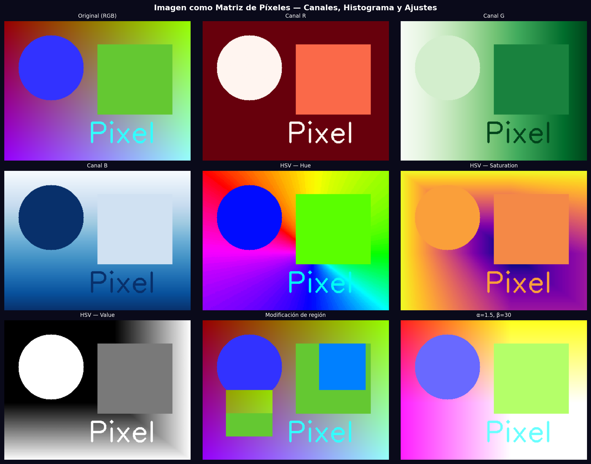
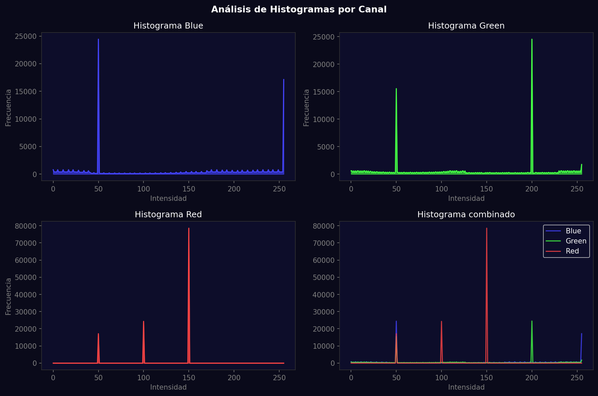

# Taller - De Pixels a Coordenadas: Explorando la Imagen como Matriz

## Nombre del estudiante
Gabriel Andrés Anzola Tachak

## Fecha de entrega
`2026-05-29`

---

## Descripción breve

Este taller explora la representación digital de imágenes como matrices numéricas. Se carga una imagen color, se separan los canales RGB y HSV, se realiza slicing para modificar regiones específicas (cambio de color y copia de regiones), se calculan y visualizan histogramas de intensidad por canal, y se aplican ajustes de brillo/contraste mediante `cv2.convertScaleAbs()`.

---

## Implementaciones

### Python

**Herramientas:** `opencv-python`, `numpy`, `matplotlib`

| Función | Descripción |
|---|---|
| `cv2.split()` | Separación de canales B, G, R de la imagen |
| `cv2.cvtColor(img, cv2.COLOR_BGR2HSV)` | Conversión al espacio HSV |
| Slicing NumPy | Modificación de regiones: `img[y1:y2, x1:x2] = nuevo_valor` |
| `cv2.calcHist()` | Cálculo del histograma de intensidades por canal |
| `cv2.convertScaleAbs(img, alpha, beta)` | Ajuste de brillo (β) y contraste (α) |

---

## Resultados visuales

### Python - Implementación


Imagen original, canales RGB individuales, canales HSV y regiones modificadas con slicing.


Histogramas de intensidad por canal (R, G, B) y combinado, mostrando la distribución de píxeles.

---

## Código relevante

```python
# Separar canales
b, g, r = cv2.split(img)

# Modificar región con slicing
img[50:150, 250:350] = [255, 128, 0]  # naranja
img[150:250, 50:150] = img[0:100, 250:350]  # copiar región

# Ajuste brillo/contraste
bright_contrast = cv2.convertScaleAbs(img, alpha=1.5, beta=30)
# pixel_nuevo = alpha * pixel_viejo + beta

# Histograma
hist = cv2.calcHist([canal], [0], None, [256], [0, 256])
```

---

## Prompts utilizados

- "Explore image as pixel matrix in OpenCV: split RGB/HSV channels, region slicing, brightness/contrast adjustment with convertScaleAbs, histogram visualization per channel"

---

## Aprendizajes y dificultades

### Aprendizajes
- Una imagen en NumPy es un array `(H, W, C)` donde C=3 para BGR en OpenCV.
- `alpha` en `convertScaleAbs` controla el contraste (>1 aumenta, <1 reduce); `beta` desplaza el brillo.
- El canal Hue en HSV es circular (0°-180° en OpenCV), útil para segmentación por color.

### Dificultades
- OpenCV usa BGR por defecto; hay que convertir a RGB para matplotlib con `cv2.cvtColor(img, cv2.COLOR_BGR2RGB)`.

### Mejoras futuras
- Implementar ecualización de histograma (`cv2.equalizeHist`) para mejorar contraste automáticamente.
- Agregar sliders interactivos con `cv2.createTrackbar` para ajuste en tiempo real.

---

## Contribuciones grupales
Taller realizado de forma individual.

---

## Estructura del proyecto

```
semana_9_3_imagen_matriz_pixeles/
├── python/
│   ├── semana_9_3.ipynb
│   └── generate_media.py
├── media/
│   ├── pixel_matrix_channels.png
│   └── pixel_histograms.png
└── README.md
```

---

## Referencias
- NumPy array indexing: https://numpy.org/doc/stable/user/basics.indexing.html
- cv2.calcHist: https://docs.opencv.org/4.x/d6/dc7/group__imgproc__hist.html
- HSV color space: https://en.wikipedia.org/wiki/HSL_and_HSV

---

## Checklist
- [x] Carpeta con nombre semana_9_3_imagen_matriz_pixeles
- [x] Código limpio y funcional
- [x] GIFs/imágenes en media/ con nombres descriptivos
- [x] README completo con todas las secciones
- [x] Mínimo 2 capturas/GIFs por implementación
- [x] Commits descriptivos en inglés
