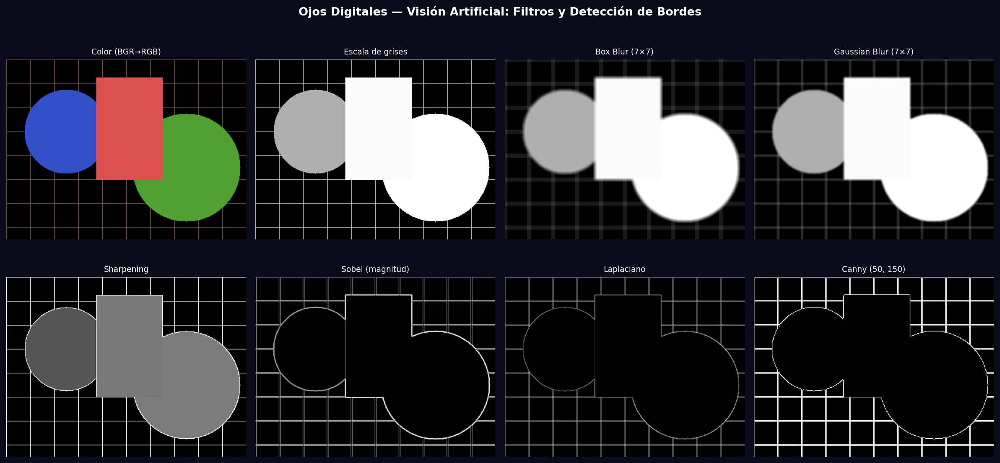
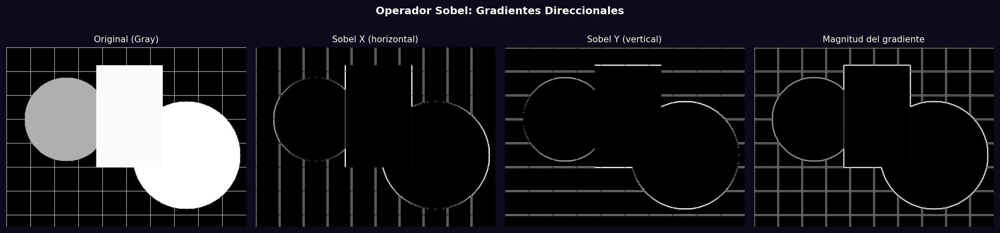

# Taller - Ojos Digitales: Introducción a la Visión Artificial

## Nombre del estudiante
Gabriel Andrés Anzola Tachak

## Fecha de entrega
`2026-05-29`

---

## Descripción breve

Exploración de los fundamentos de visión artificial mediante OpenCV: conversión a escala de grises, filtros de suavizado (box blur, Gaussian blur), realce (sharpening), y detección de bordes con Sobel, Laplaciano y Canny. Se comparan visualmente 8 operaciones sobre la misma imagen sintética, y se analiza el operador Sobel en sus componentes X, Y y magnitud del gradiente.

---

## Implementaciones

### Python

**Herramientas:** `opencv-python`, `numpy`, `matplotlib`

| Función | Descripción |
|---|---|
| `cv2.cvtColor(img, cv2.COLOR_BGR2GRAY)` | Conversión a escala de grises |
| `cv2.blur()` / `cv2.GaussianBlur()` | Suavizado: promedio simple vs. gaussiano |
| `cv2.filter2D()` | Sharpening con kernel `[[-1,-1,-1],[-1,9,-1],[-1,-1,-1]]` |
| `cv2.Sobel()` | Gradiente en X y Y, magnitud = √(Gx²+Gy²) |
| `cv2.Laplacian()` | Derivada segunda — sensible a todos los bordes |
| `cv2.Canny()` | Detección robusta con histeresis y supresión de no-máximos |

---

## Resultados visuales

### Python - Implementación


Pipeline completo: color → gris → blur → Gaussian blur → sharpen → Sobel → Laplaciano → Canny.


Descomposición del operador Sobel: imagen original, gradiente X, gradiente Y y magnitud.

---

## Código relevante

```python
# Conversión y filtros básicos
gray = cv2.cvtColor(img_color, cv2.COLOR_BGR2GRAY)
blur_box = cv2.blur(gray, (7, 7))
blur_gaussian = cv2.GaussianBlur(gray, (7, 7), 0)
sharpened = cv2.filter2D(gray, -1, np.array([[-1,-1,-1],[-1,9,-1],[-1,-1,-1]], np.float32))

# Detección de bordes
sobel_x = cv2.Sobel(gray, cv2.CV_64F, 1, 0, ksize=3)
sobel_y = cv2.Sobel(gray, cv2.CV_64F, 0, 1, ksize=3)
sobel_mag = np.sqrt(sobel_x**2 + sobel_y**2)
laplacian = np.abs(cv2.Laplacian(gray, cv2.CV_64F))
canny = cv2.Canny(gray, 50, 150)
```

---

## Prompts utilizados

- "Compare 7 OpenCV image processing operations: grayscale, box blur, Gaussian blur, sharpening, Sobel XY magnitude, Laplacian, Canny edge detection"

---

## Aprendizajes y dificultades

### Aprendizajes
- Box blur promedia todos los vecinos por igual; Gaussian blur pondera más el centro → menos artefactos.
- `cv2.CV_64F` en Sobel/Laplacian permite valores negativos; luego se convierte con `np.abs()` o `cv2.convertScaleAbs()`.
- Canny tiene tres etapas: gradiente, supresión de no-máximos, histeresis — es más robusto que Sobel solo.

### Dificultades
- El Laplaciano es muy sensible al ruido; se recomienda aplicar Gaussian blur primero (LoG).

### Mejoras futuras
- Implementar LoG (Laplacian of Gaussian) para detección de bordes más robusta.
- Comparar con detectores modernos como HED (Holistically-nested Edge Detection).

---

## Contribuciones grupales
Taller realizado de forma individual.

---

## Estructura del proyecto

```
semana_9_4_ojos_digitales_vision_artificial/
├── python/
│   ├── semana_9_4.ipynb
│   └── generate_media.py
├── media/
│   ├── digital_vision_filters.png
│   └── sobel_gradients.png
└── README.md
```

---

## Referencias
- OpenCV filtering: https://docs.opencv.org/4.x/d4/d86/group__imgproc__filter.html
- Canny edge detector: https://en.wikipedia.org/wiki/Canny_edge_detector
- Sobel operator: https://en.wikipedia.org/wiki/Sobel_operator

---

## Checklist
- [x] Carpeta con nombre semana_9_4_ojos_digitales_vision_artificial
- [x] Código limpio y funcional
- [x] GIFs/imágenes en media/ con nombres descriptivos
- [x] README completo con todas las secciones
- [x] Mínimo 2 capturas/GIFs por implementación
- [x] Commits descriptivos en inglés
