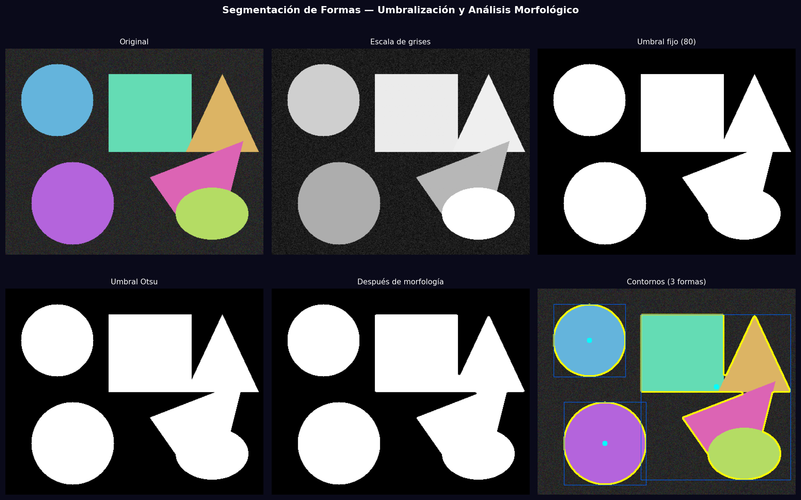
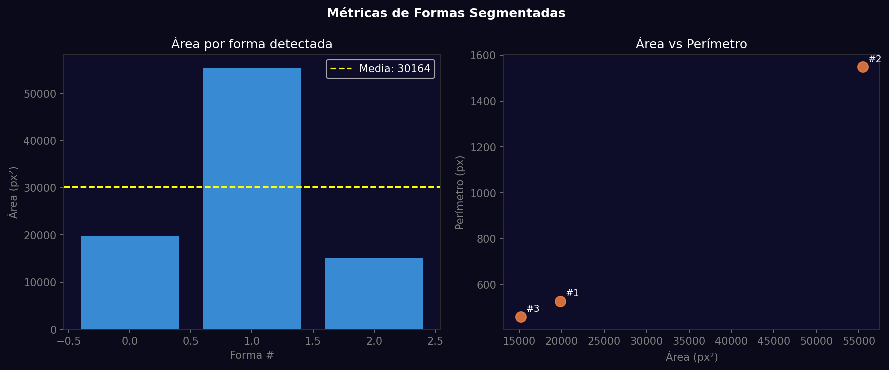

# Taller - Segmentando el Mundo: Binarización y Reconocimiento de Formas

## Nombre del estudiante
Gabriel Andrés Anzola Tachak

## Fecha de entrega
`2026-05-29`

---

## Descripción breve

Segmentación de imágenes usando umbralización fija, adaptativa y el método de Otsu. Se aplican operaciones morfológicas (apertura y cierre) para limpiar el mapa binario antes de detectar contornos. Para cada forma detectada se calcula el centro de masa, bounding box, área y perímetro, con visualización y tabla de métricas comparativas.

---

## Implementaciones

### Python

**Herramientas:** `opencv-python`, `numpy`, `matplotlib`

| Función | Descripción |
|---|---|
| `cv2.threshold()` fijo | Umbral fijo en 80: píxel > 80 → 255, else 0 |
| `cv2.adaptiveThreshold()` | Umbral calculado localmente en vecindades de 21×21 |
| Otsu (`THRESH_OTSU`) | Umbral óptimo calculado automáticamente maximizando varianza inter-clase |
| `cv2.morphologyEx()` | Apertura (elimina ruido) + cierre (rellena huecos) con kernel elipsoidal |
| `cv2.boundingRect()` | Bounding box de cada contorno |
| `cv2.moments()` | Centro de masa de cada forma detectada |

---

## Resultados visuales

### Python - Implementación


Pipeline completo: original → escala de grises → umbral fijo → Otsu → morfología → contornos.


Gráficos de área por forma y dispersión área vs. perímetro de las formas detectadas.

---

## Código relevante

```python
# Diferentes métodos de umbralización
_, thresh_fixed = cv2.threshold(gray, 80, 255, cv2.THRESH_BINARY)
thresh_adaptive = cv2.adaptiveThreshold(gray, 255, cv2.ADAPTIVE_THRESH_GAUSSIAN_C,
                                         cv2.THRESH_BINARY, 21, 5)
_, thresh_otsu = cv2.threshold(gray, 0, 255, cv2.THRESH_BINARY + cv2.THRESH_OTSU)

# Morfología para limpiar
kernel = cv2.getStructuringElement(cv2.MORPH_ELLIPSE, (5, 5))
cleaned = cv2.morphologyEx(thresh_otsu, cv2.MORPH_OPEN, kernel)
cleaned = cv2.morphologyEx(cleaned, cv2.MORPH_CLOSE, kernel)

# Análisis de contornos
for cnt in contours:
    M = cv2.moments(cnt)
    cx = int(M['m10'] / M['m00'])
    cy = int(M['m01'] / M['m00'])
    x, y, w, h = cv2.boundingRect(cnt)
```

---

## Prompts utilizados

- "Segment shapes using fixed threshold, adaptive threshold, Otsu method; clean with morphological open/close; detect contours with bounding boxes and centroids"

---

## Aprendizajes y dificultades

### Aprendizajes
- Otsu calcula automáticamente el umbral óptimo minimizando la varianza intra-clase; funciona mejor cuando el histograma es bimodal.
- `MORPH_OPEN` = erosión + dilatación: elimina ruido pequeño.
- `MORPH_CLOSE` = dilatación + erosión: rellena huecos internos.

### Dificultades
- El umbral adaptativo puede fragmentar objetos con textura interna compleja.

### Mejoras futuras
- Segmentación por color en espacio HSV con `cv2.inRange()` para objetos de colores específicos.
- Watershed para segmentar objetos solapados.

---

## Contribuciones grupales
Taller realizado de forma individual.

---

## Estructura del proyecto

```
semana_9_5_segmentacion_formas/
├── python/
│   ├── semana_9_5.ipynb
│   └── generate_media.py
├── media/
│   ├── segmentation_shapes.png
│   └── segmentation_metrics.png
└── README.md
```

---

## Referencias
- Otsu's method: https://en.wikipedia.org/wiki/Otsu%27s_method
- Morphological operations: https://docs.opencv.org/4.x/d9/d61/tutorial_py_morphological_ops.html

---

## Checklist
- [x] Carpeta con nombre semana_9_5_segmentacion_formas
- [x] Código limpio y funcional
- [x] GIFs/imágenes en media/ con nombres descriptivos
- [x] README completo con todas las secciones
- [x] Mínimo 2 capturas/GIFs por implementación
- [x] Commits descriptivos en inglés
